# MeeraAuth — Usage Guide

Headless **Swift 6** authentication SDK for MeeraSpace SSO X (**App Client / API mode**).

MeeraAuth owns auth **flows, errors, session, and tokens**.  
Your host app owns **UI** and **networking** (TFNetwork / URLSession).

Image captcha UI is **not** supported.

---

## Table of contents

1. [Overview](#1-overview)
2. [Install](#2-install)
3. [Configuration](#3-configuration)
4. [Create AuthClient](#4-create-authclient)
5. [Signup / registration](#5-signup--registration)
6. [Login](#6-login)
7. [MFA (second factor)](#7-mfa-second-factor)
8. [Token exchange, refresh & using the access token](#8-token-exchange-refresh--using-the-access-token)
9. [Logout](#9-logout)
10. [Forgot / reset password](#10-forgot--reset-password)
11. [Update / reset email (settings)](#11-update--reset-email-settings)
12. [Update mobile (settings)](#12-update-mobile-settings)
13. [Verification (activate email / mobile)](#13-verification-activate-email--mobile)
14. [Civil ID bind (settings)](#14-civil-id-bind-settings)
15. [Cold start & session helpers](#15-cold-start--session-helpers)
16. [Events](#16-events)
17. [Errors](#17-errors)
18. [Network logging](#18-network-logging)
19. [MVI pattern](#19-mvi-pattern)
20. [API quick reference](#20-api-quick-reference)
21. [Host checklist](#21-host-checklist)
22. [Service docs (JSON + HTTP)](#22-service-docs-json--http)

---

## 1. Overview

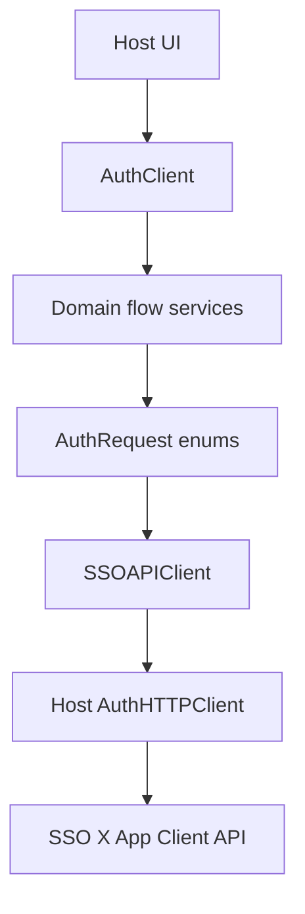

### Host journeys (where to look)

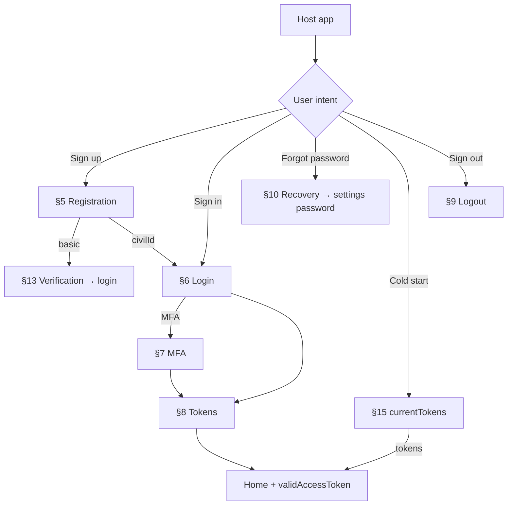

Hosts only use `AuthClient`. Internally, SSO calls follow an Elevate-style **request enum** pattern (`LoginRequest`, `RegistrationRequest`, `TokenRequest`, …): each case owns path, query, headers, and body; `SSOAPIClient` builds `AuthHTTPRequest` for the host-injected HTTP client (no TFNetwork inside the package).

| Folder | Contents |
|--------|----------|
| `Public/Client` | `AuthClient` + `Extensions/` (Events, Session, Login, Registration, …) |
| `Public/Configuration` | `AuthConfiguration`, scopes, locale, resources, MFAPolicy |
| `Public/Models` | `Session/`, `Login/`, `Registration/` model groups |
| `Public/Errors` | `AuthError`, `AuthErrorPresenter`, `AuthErrorCatalog.json` |
| `Domain/Flows` | Per-flow services (`Login/`, `Registration/`, `Recovery/`, …) |
| `Domain/Tokens` | Token exchange / refresh |
| `Domain/Client` | `AuthClientServing` |
| `Data/Requests` | Per-flow `AuthRequest` enums (+ `Core/`) |
| `Data/Client` | `SSOAPIClient` |
| `Data/Parsing` | Flow JSON parsing |
| `Infrastructure/Networking` | `AuthHTTPClient`, `AuthNetworkLogging` |
| `Infrastructure/Support` | Curl formatter helpers |
| `Infrastructure/Storage` | Keychain / in-memory stores |

| Concern | Owner |
|---------|--------|
| Screens, navigation, MVI | Host |
| SSO flows, `AuthError`, Keychain tokens | MeeraAuth |
| HTTP transport | Host (`AuthHTTPClient`) |

Flow services (`LoginFlowServing`, `TokenServing`, …) and `AuthClientServing` are **package-internal**. Hosts call `AuthClient` only.

**Platforms:** iOS 16+, macOS 13+ · **Swift 6**

---

## 2. Install

Add local SPM package `Packages/MeeraAuth`.

```swift
import MeeraAuth
```

If the host uses TFNetwork (CocoaPods), implement `AuthHTTPClient` in the **host** (see `HostApp/.../TFNetworkHTTPClient.swift`).  
MeeraAuth does **not** depend on TFNetwork.

Built-in alternative for tests / simple hosts:

```swift
URLSessionAuthHTTPClient()
```

---

## 3. Configuration

Hosts **must** pass required values. Invalid config **traps at init** (`preconditionFailure`) — programmer error.

```swift
let environment = AuthEnvironment.test10   // host-owned
let locale = AuthLocale.english

// Each hosting app must pass its own templates (locale-less).
let resources = AuthResourceTemplates(
    emailOTP: "{sso}{emailOtpTmpl}",
    mobileOTP: "{sso}{mobileOtpTmpl}",
    resetEmail: "{sso}{resetEmailTmpl}",
    resetMobile: "{sso}{resetMobileTmpl}",
    activeEmail: "{sso}{activeEmailTmpl}",
    activeMobile: "{sso}{activeMobileTmpl}"
)

let config = AuthConfiguration(
    ssoEndpoint: environment.ssoEndpoint,
    ssoXEndpoint: environment.ssoXEndpoint,
    clientId: .mobileApp,
    scopes: [.openid, .email, .mobile, .groups, .profile, .offlineAccess],
    locale: locale,         // injected into resources → `{sso}{en}{…Tmpl}`
    loginOptions: [.email, .phone, .civilId],
    signupOptions: [.basic, .civilId],  // empty = signup off; independent of loginOptions
    resources: resources,
    mfaPolicy: MFAPolicy(autoSendOTP: true),
    networkLogging: .verbose   // DEBUG only
)
```

### SSO endpoints

MeeraSpace SSO exposes **two bases** — same host in most environments, different path roots:

| Config | Example | Used for |
|--------|---------|----------|
| `ssoEndpoint` | `https://sso.test10.meeraspace.com` | OAuth token + logout (`POST /token`, session teardown) |
| `ssoXEndpoint` | `https://sso.test10.meeraspace.com/x` | Login / MFA / recovery / settings / verification flows |

Provide both explicitly. Do not assume the SDK appends `/x` — some environments use different hosts or ports for each.

### Typed constants (no magic strings)

| Type | Examples |
|------|----------|
| `AuthClientID` | `.mobileApp`, `.meeraApps`, `.custom("…")` |
| `AuthScope` | `.openid`, `.email`, `.mobile`, `.groups`, `.profile`, `.offlineAccess`, `.custom("…")` |
| `AuthLocale` | `.english` (`en`), `.arabic` (`ar`) |
| `LoginOption` | `.email`, `.phone`, `.civilId` |
| `SignupOption` | `.basic`, `.civilId` (independent of login) |

### Login option → SSO method

| Host option | Identifier | SSO `method` |
|-------------|------------|--------------|
| `.email` | email | `password` |
| `.phone` | mobile E.164 | `password` |
| `.civilId` | Civil ID | `civilid` |

`loginOptions` is a **client allow-list**. Calling `login(option:)` for a path not listed throws `AuthError.methodDisabled` **before** SSO is contacted. Empty `loginOptions` is **invalid** (init crash).

### Signup options (`signupOptions`)

Independent of `loginOptions`. Controls which registration APIs the host may call.

| Host sets | Effect |
|-----------|--------|
| `signupOptions: []` (default) | Signup off — valid. `startRegistration()` throws `AuthError.signupDisabled()`. Hide signup UI. |
| `[.basic]` | Basic password signup only (`register(_:)`) |
| `[.civilId]` | Civil ID wizard only |
| `[.basic, .civilId]` | Both paths |

```swift
// Civil ID product — login + signup via Civil ID only
loginOptions: [.civilId],
signupOptions: [.civilId]

// Email/phone login; basic signup only (no Civil ID registration)
loginOptions: [.email, .phone],
signupOptions: [.basic]

// Full sample HostApp
loginOptions: [.email, .phone, .civilId],
signupOptions: [.basic, .civilId]
```

Gate host UI with `auth.configuration.signupOptions` (e.g. show “Sign up with Civil ID” only when `.civilId` is present). Calling a disabled path throws `AuthError.signupMethodDisabled` **before** SSO is contacted.

### Resource templates

**Required.** Host passes **locale-less** templates; the SDK injects `locale` when calling SSO:

| Host (config) | Wire (SSO) |
|---------------|------------|
| `{sso}{emailOtpTmpl}` | `{sso}{en}{emailOtpTmpl}` |

```swift
resources: AuthResourceTemplates(
    emailOTP: "{sso}{emailOtpTmpl}",
    mobileOTP: "{sso}{mobileOtpTmpl}",
    resetEmail: "{sso}{resetEmailTmpl}",
    resetMobile: "{sso}{resetMobileTmpl}",
    activeEmail: "{sso}{activeEmailTmpl}",
    activeMobile: "{sso}{activeMobileTmpl}"
)
```

| Field | Example host value |
|-------|-------------------|
| `emailOTP` | `{sso}{emailOtpTmpl}` |
| `mobileOTP` | `{sso}{mobileOtpTmpl}` |
| `resetEmail` | `{sso}{resetEmailTmpl}` |
| `resetMobile` | `{sso}{resetMobileTmpl}` |
| `activeEmail` | `{sso}{activeEmailTmpl}` |
| `activeMobile` | `{sso}{activeMobileTmpl}` |

Empty template strings fail `AuthConfiguration` validation at init.

### Fail-fast validation

Missing / empty `clientId`, `scopes`, `loginOptions`, bad endpoints, empty resources → **crash with checklist** at `AuthConfiguration` / `AuthClient` init.  
Empty `signupOptions` is **valid** (signup disabled for that host).  
Tests: `AuthConfiguration.validationIssues(in:)`.

---

## 4. Create AuthClient

Full host example (mirrors `HostApp/HostApp/App/HostAppApp.swift`):

```swift
let auth = AuthClient(
    configuration: config,
    httpClient: TFNetworkHTTPClient(),       // host — required
    sessionStore: InMemorySessionStore(),    // optional — this is the default
    tokenStore: KeychainTokenStore()         // optional — default service = "{bundleId}.auth.tokens"
)
```

`AuthClient` is an **actor** — always `await`.

---

## 5. Signup / registration

Signup is **opt-in** via `AuthConfiguration.signupOptions` (see [§3](#3-configuration)). It does **not** inherit from `loginOptions`.

Always call `startRegistration()` first (`GET {ssoX}/registration/api`) when at least one signup option is enabled.

| `signupOptions` | Host can call |
|-----------------|---------------|
| `[]` (default) | Nothing — `startRegistration()` → `AuthError.signupDisabled()` |
| `[.basic]` | `register(_:)` only |
| `[.civilId]` | Civil ID wizard only |
| `[.basic, .civilId]` | Both |

| Guard | When | Error |
|-------|------|-------|
| Empty allow-list | `startRegistration()` | `AuthError.signupDisabled()` |
| Missing `.basic` | `register(_:)` | `AuthError.signupMethodDisabled(.basic, …)` |
| Missing `.civilId` | Any Civil ID registration API | `AuthError.signupMethodDisabled(.civilId, …)` |

These are **client allow-list** failures (`AuthErrorCode.methodDisabled`) — SSO is not contacted. Context includes `fault: host.signupOptions`.

MeeraAuth supports **both** App Client paths from SSO docs:

| Path | Requires in `signupOptions` | Host API |
|------|----------------------------|----------|
| Basic password | `.basic` | `register(_:)` |
| Civil ID wizard | `.civilId` | stepped `verifyRegistrationCivilId` → mobile OTP → email OTP → `submitRegistrationPassword` |

**After success (SSO App Client):**

| Path | Typical outcome | Host next |
|------|-----------------|-----------|
| **Basic** | Always `.requiresVerification` | `verificationSendOTP` → `verificationVerifyOTP` → **login** UI |
| **Civil ID** | `.completed` (identity; often `session == nil`) | **Login** UI — do **not** auto-login / `exchangeTokens()` when session is nil |

Upstream: `docs/sso-reference/x-register-flow.md`, `x-register-flow-civilid.md`. Deep JSON: [services/registration.md](./services/registration.md).

### Decision tree

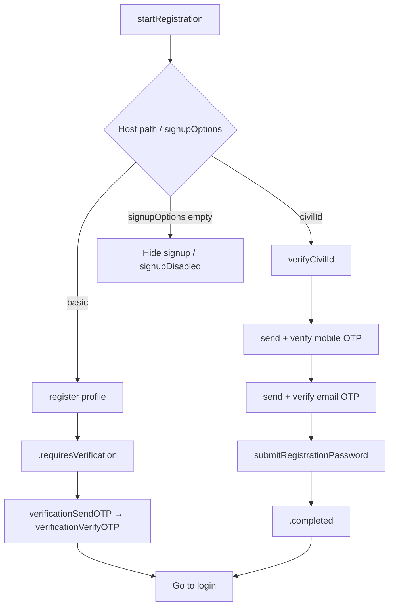

Per SSO docs: **basic** always jumps to `/verification`; **Civil ID** ends completed — no verification handoff.

### Basic signup

Requires `signupOptions` to contain `.basic`.

```swift
try await auth.startRegistration()

let step = try await auth.register(
    RegistrationProfile(
        email: "user@example.com",
        mobile: "",
        username: "user",
        password: password,
        confirmPassword: password
    )
)

switch step {
case .requiresVerification:
    // Flow already seeded from registration response — skip startVerification()
    try await auth.verificationSendOTP(channel: .email, identifier: "user@example.com")
    try await auth.verificationVerifyOTP(code)
    // navigate to login UI — call startLogin() when presenting login

case .completed:
    // Not the App Client happy path for basic; still handle defensively → login
    break
}
```

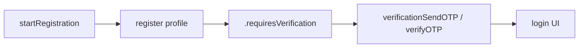

### Civil ID signup

Requires `signupOptions` to contain `.civilId`.

Oman / Meera Civil ID onboarding. Each step **succeeds** or **throws `AuthError`** until the final `submitRegistrationPassword`, which returns `RegistrationStep`.

Sample HostApp: `Features/Auth/Signup/` — method picker shows signup when `auth.configuration.signupOptions.contains(.civilId)`.

#### Decision tree

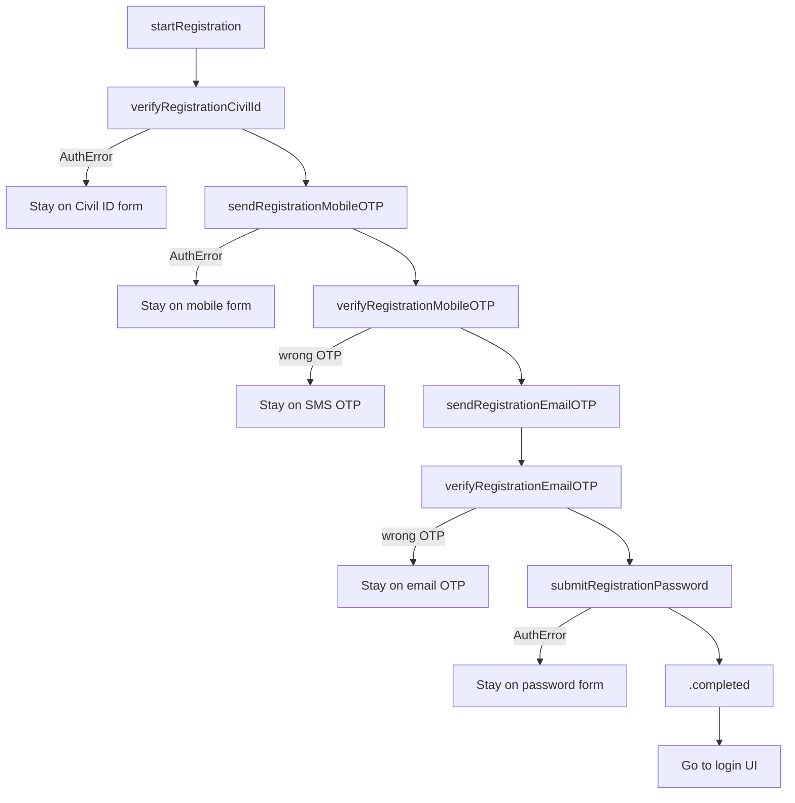

Civil ID OTPs happen on **`/registration`**. SSO App Client success is identity / `civilid_completed` — **not** a `/verification` handoff.

#### Step table

| # | Call | Success | Failure | Host UI next |
|---|------|---------|---------|--------------|
| 1 | `startRegistration()` | Flow id stored | `signupDisabled` / network / `6014` | Civil ID form |
| 2 | `verifyRegistrationCivilId(_:expiry:)` | Civil ID accepted | `signupMethodDisabled` / `6077`–`6090` | Mobile form |
| 3 | `sendRegistrationMobileOTP(...)` | OTP sent (`6062` info OK) | Bad mobile / rate limit | SMS OTP screen |
| 3b | `resendRegistrationMobileOTP()` | New OTP | Too frequent | Stay on SMS OTP |
| 4 | `verifyRegistrationMobileOTP(_:)` | Mobile verified | Wrong / expired code | Stay on SMS OTP |
| 5 | `sendRegistrationEmailOTP(_:)` | OTP sent | Bad email / rate limit | Email OTP screen |
| 5b | `resendRegistrationEmailOTP()` | New OTP | Too frequent | Stay on email OTP |
| 6 | `verifyRegistrationEmailOTP(_:)` | Email verified | Wrong / expired code | Stay on email OTP |
| 7 | `submitRegistrationPassword(...)` | `RegistrationStep` | Password / identity errors | Login or exchange |

Resend APIs reuse the last mobile / email cached by the SDK — call send first.

#### Sequence (happy path)

```swift
try await auth.startRegistration()

try await auth.verifyRegistrationCivilId("1234567", expiry: "2026-01-01")

try await auth.sendRegistrationMobileOTP(
    mobile: "+9689xxxxxxx",
    username: fullNameFromCivilId,
    useCivilIDMobile: true
)
try await auth.verifyRegistrationMobileOTP(mobileOTP)

try await auth.sendRegistrationEmailOTP("user@example.com")
try await auth.verifyRegistrationEmailOTP(emailOTP)

let step = try await auth.submitRegistrationPassword(
    password: password,
    confirmPassword: password
)

switch step {
case .completed:
    // Typical Civil ID — navigate to login (HostApp: Civil ID login)
    // Call startLogin() when presenting login, not as an auto-login shortcut.
    break
case .requiresVerification:
    // Not expected on Civil ID App Client path — handle only if SSO changes
    try await auth.verificationSendOTP(channel: .email, identifier: email)
    try await auth.verificationVerifyOTP(code)
}
```

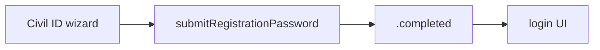

### Request / response JSON

#### Start — `GET {SSO_X}/registration/api`

```json
{
  "id": "reg-flow-id",
  "type": "api",
  "ui": { "forms": [/* nodes */] },
  "expiresAt": "…",
  "issuedAt": "…"
}
```

MeeraAuth stores `id` as registration `flowId`.

#### Basic submit — `POST {SSO_X}/registration?flow=`

```json
{
  "email": "user@example.com",
  "mobile": "+9689xxxxxxx",
  "username": "display name",
  "firstname": "",
  "middlename": "",
  "lastname": "",
  "password": "••••••••",
  "confirmPassword": "••••••••",
  "resource": "{sso}{en}{…}",
  "method": "password"
}
```

**Success (App Client):** verification handoff (`action` → `/x/verification?flow=…`) → `.requiresVerification`. Errors in `ui` messages → `AuthError`.

#### Civil ID verify

```json
{
  "method": "civilid",
  "civilId": "12345678",
  "civilIdExpiry": "2026-01-01"
}
```

#### Send mobile OTP

```json
{
  "method": "civilid",
  "mobile": "+9689xxxxxxx",
  "username": "optional",
  "resource": "{sso}{en}{mobileOtpTmpl}",
  "useCivilIDMobile": true,
  "flowTokenId": "optional"
}
```

**Response includes** (in `ui` nodes):

```json
{
  "attributes": {
    "id": "flowTokenId",
    "name": "flowTokenId",
    "value": "n7q5bKAxZkJ754Ts2xLRae"
  }
}
```

#### Verify OTP (mobile or email)

```json
{
  "method": "civilid",
  "code": "123456",
  "flowTokenId": "n7q5bKAxZkJ754Ts2xLRae",
  "resource": "{sso}{en}{activeMobileTmpl}"
}
```

(Email verify uses `activeEmailTmpl`.)

#### Send email OTP

```json
{
  "method": "civilid",
  "email": "user@example.com",
  "resource": "{sso}{en}{emailOtpTmpl}",
  "flowTokenId": "…"
}
```

#### Civil ID password

```json
{
  "method": "civilid",
  "password": "••••••••",
  "confirmPassword": "••••••••"
}
```

**Success:** typically identity / `civilid_completed` → `.completed` (often `session == nil` — go to login).

### Common errors

| Code / factory | Meaning |
|----------------|---------|
| `AuthError.signupDisabled()` | `signupOptions` empty — client allow-list |
| `AuthError.signupMethodDisabled(_:enabled:)` | Path not in `signupOptions` — client allow-list |
| `6014` | Registration disabled on SSO |
| `6047` / `6060` / `6061` | Identity / email / mobile already exists |
| `6077`–`6084`, `6090` | Civil ID validation |

---

## 6. Login

Enable paths with `AuthConfiguration.loginOptions`. Calling a disabled option throws `AuthError.methodDisabled` **before** SSO is contacted (independent of `signupOptions`).

### Always start the flow first

SSO requires a login flow id:

1. `startLogin()` → `GET {ssoX}/login/api`
2. `login(...)` → `POST {ssoX}/login?flow={id}`

### Email login

```swift
do {
    try await auth.startLogin()

    let step = try await auth.login(
        option: .email,
        identifier: "user@example.com",
        password: password
    )

    switch step {
    case .authenticated:
        let tokens = try await auth.exchangeTokens()
        // navigate home — use tokens.accessToken

    case .requiresMFA(let channel, _):
        // show OTP UI for channel (.email or .sms)
        showMFA(channel: channel)
    }
} catch let error as AuthError {
    switch error.code {
    case .flowExpired:
        // restart: startLogin() again
        break
    default:
        break
    }
    // Localized UI (en / ar / ar-OM) — not SSO English
    showAlert(error.localizedDescription)
    // Logs: error.message (server raw text)
}
```

### Phone login

```swift
try await auth.startLogin()
let step = try await auth.login(
    option: .phone,
    identifier: "+9689xxxxxxx",
    password: password
)
```

### Civil ID login

```swift
try await auth.startLogin()
let step = try await auth.login(
    option: .civilId,
    identifier: civilIdNumber,
    password: password
)
```

### Decision tree

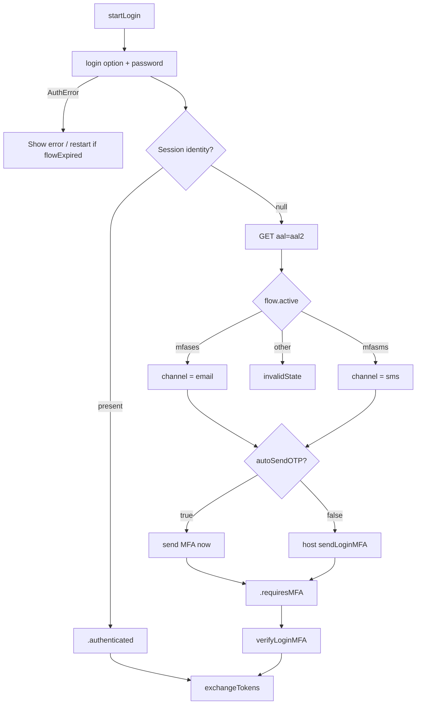

Channel comes from SSO `active` only. `MFAPolicy.autoSendOTP` only controls **when** the first OTP is sent.

### Request / response JSON

#### Start — `GET {SSO_X}/login/api`

```json
{
  "id": "login-flow-id",
  "type": "api",
  "active": "password",
  "ui": { "forms": [/* password nodes */] },
  "expiresAt": "2025-09-11T08:00:00Z",
  "issuedAt": "2025-09-11T07:00:00Z"
}
```

MeeraAuth stores `id` as login `flowId`.

#### Submit credentials — `POST {SSO_X}/login?flow={loginFlowId}`

**Request (email)**

```json
{
  "email": "user@example.com",
  "mobile": "",
  "password": "••••••••",
  "method": "password"
}
```

(`phone` → `mobile` filled; `civilId` → `civilId` + `"method": "civilid"`.)

**Response — MFA required**

```json
{
  "id": "iTSf98STCqMuzznPPeMkKb",
  "userId": "3d88Accd7C8uURsdmXnTrV",
  "active": true,
  "authenticatorAssuranceLevel": "aal1",
  "authenticationMethods": [
    { "method": "password", "aal": "aal1", "completed_at": "…" }
  ],
  "identity": null
}
```

- `id` → session id (`X-SESSION-ID`)
- `identity: null` → MFA required (`Session.requiresMFA`)
- Here `active` is a **bool**, not MFA method

**Response — no MFA:** same shape with non-null `identity` → `.authenticated`.

#### AAL2 flow — `GET {SSO_X}/login/api?aal=aal2`

**Headers:** `X-SESSION-ID: {sessionId}`

**Response — email MFA**

```json
{
  "id": "bKeuKkZoPSzPtjUHwLnv4q",
  "type": "api",
  "active": "mfases",
  "requestedAal": "aal2",
  "ui": {
    "forms": [
      {
        "id": "mfases",
        "nodes": [
          { "attributes": { "id": "email", "name": "email", "value": "user@example.com" } },
          { "attributes": { "id": "method", "name": "method", "value": "mfases" } }
        ]
      }
    ]
  }
}
```

**SMS MFA:** `"active": "mfasms"` (+ `mobile` node).

| `active` | Channel | OTP |
|----------|---------|-----|
| `mfases` | `.email` | Email |
| `mfasms` | `.sms` | SMS |
| other | — | `AuthError.invalidState` |

#### Send MFA — `POST {SSO_X}/login?flow={mfaFlowId}`

**Headers:** `Content-Type: application/json`, `X-SESSION-ID`

**Email**

```json
{
  "method": "mfases",
  "resource": "{sso}{en}{emailOtpTmpl}",
  "email": "user@example.com"
}
```

**SMS**

```json
{
  "method": "mfasms",
  "resource": "{sso}{en}{mobileOtpTmpl}",
  "mobile": "+9689xxxxxxx"
}
```

(Resend also sends `flowTokenId` when already known.)

**Response:** flow with `flowTokenId` node — MeeraAuth stores it for verify.

#### Verify MFA — `POST {SSO_X}/login?flow={mfaFlowId}`

**Email**

```json
{
  "resource": "{sso}{en}{emailOtpTmpl}",
  "method": "mfases",
  "flowTokenId": "7xgwKCkkS4mt6G8VNaMvDE",
  "code": "8572"
}
```

**SMS**

```json
{
  "method": "mfasms",
  "flowTokenId": "ER5Ry2BtkEaz5TbNWXQRRw",
  "code": "2749"
}
```

No `email` / `mobile` on verify.

**Success (trimmed)**

```json
{
  "id": "iTSf98STCqMuzznPPeMkKb",
  "authenticatorAssuranceLevel": "aal2",
  "authenticationMethods": [
    { "method": "password", "aal": "aal1" },
    { "method": "mfases", "aal": "aal2" }
  ],
  "identity": {
    "userId": "…",
    "email": "user@example.com",
    "mobile": "+9689xxxxxxx",
    "emailVerified": true,
    "mobileVerified": true
  }
}
```

Then [§8](#8-token-exchange-refresh--using-the-access-token) for exchange.

Deep JSON notes: [services/login.md](./services/login.md).

---

## 7. MFA (second factor)

MFA is **server-driven**. After password / Civil ID login, SSO returns a session. MeeraAuth decides from that payload:

| Server session | Meaning | `LoginStep` |
|----------------|---------|-------------|
| `identity` present | Fully authenticated (AAL satisfied) | `.authenticated(session)` |
| `identity == null` | Second factor required (AAL2) | `.requiresMFA(channel, sessionId)` |

```swift
public var requiresMFA: Bool { identity == nil }  // on Session
```

The host does **not** decide “MFA on/off”. Configure only **how** MeeraAuth behaves once MFA is required (`MFAPolicy`).

### `MFAPolicy`

```swift
MFAPolicy(autoSendOTP: true)  // send OTP as soon as MFA starts
```

| Flag | Role |
|------|------|
| `autoSendOTP` | If MFA is required, send OTP immediately vs wait for host `sendLoginMFA()` |
| Channel | Always from SSO AAL2 flow `active` (`mfases` → `.email`, `mfasms` → `.sms`). Missing/unknown `active` → error. |

### Case-by-case: server MFA × `autoSendOTP`

#### Case A — MFA **not** required (`identity` present)

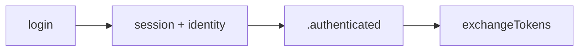

| `autoSendOTP` | Behavior |
|---------------|----------|
| `true` | **Ignored.** No OTP network call. |
| `false` | **Ignored.** Same path. |

Host next step: `exchangeTokens()` → home.

#### Case B — MFA **required** (`identity == null`) + `autoSendOTP: true` (recommended / Elevate-style)

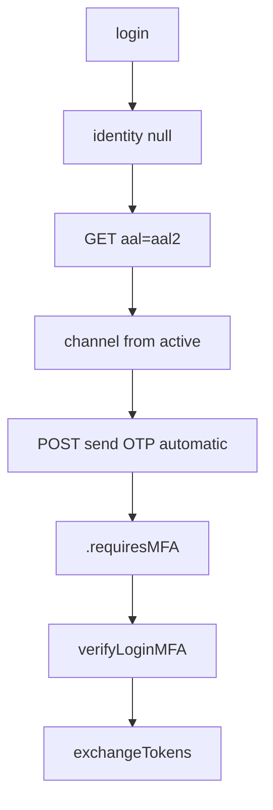

Host UI: show OTP field only (code is already on the way). Then:

```swift
let session = try await auth.verifyLoginMFA(code: otp)
let tokens = try await auth.exchangeTokens()
```

Optional resend:

```swift
try await auth.resendLoginMFA()
```

#### Case C — MFA **required** + `autoSendOTP: false`

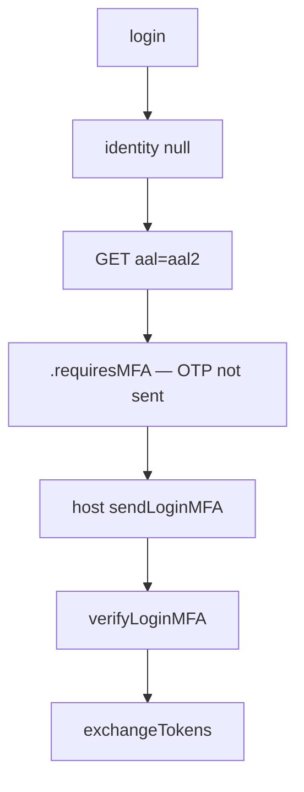

Host must send before verify:

```swift
try await auth.sendLoginMFA()          // user tapped “Send code”
let session = try await auth.verifyLoginMFA(code: otp)
let tokens = try await auth.exchangeTokens()
```

#### Case D — Login failure (wrong password, locked, validation, …)

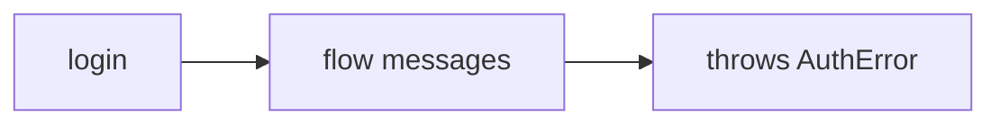

| `autoSendOTP` | Behavior |
|---------------|----------|
| either | No MFA. No OTP. Map `AuthError.field` to the form. |

### Decision tree

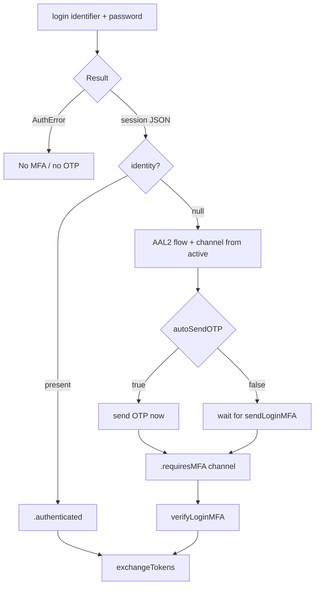

### Host code when `.requiresMFA`

```swift
// With MFAPolicy(autoSendOTP: true) — default in sample HostApp —
// OTP is already sent. Only verify (and resend if needed).

let session = try await auth.verifyLoginMFA(code: otp)
let tokens = try await auth.exchangeTokens()

try await auth.resendLoginMFA()
```

| `MFAChannel` | SSO method |
|--------------|------------|
| `.email` | `mfases` |
| `.sms` | `mfasms` |

**Senior rule:** trust the server for *whether* MFA runs; use `autoSendOTP` only for *when* the first OTP is sent.

Wire JSON for AAL2 / send / verify: [§6 Request / response JSON](#request--response-json-1) (login).

---

## 8. Token exchange, refresh & using the access token

### Exchange (after login / MFA)

```swift
let tokens = try await auth.exchangeTokens()
// tokens.accessToken
// tokens.refreshToken   // requires .offlineAccess in scopes
// tokens.idToken
// tokens.expiresIn
```

Stored in Keychain via `KeychainTokenStore`. The host does **not** manage `refresh_token` itself.

**Required scope:** include `.offlineAccess` so SSO issues a refresh token at exchange time.

```swift
scopes: [.openid, .email, .mobile, .groups, .profile, .offlineAccess]
```

### Host API — how the app gets a bearer

| Method | Use when |
|--------|----------|
| `accessToken()` | Quick read of Keychain — may be **expired** |
| `currentTokens()` | Full `TokenSet` from Keychain |
| `validAccessToken(skew:)` | **Preferred for API calls** — refreshes if expired |
| `refreshTokens()` | Force renew (e.g. backend returned 401) |

```swift
// Before every authenticated API call
let bearer = try await auth.validAccessToken()
request.setValue("Bearer \(bearer)", forHTTPHeaderField: "Authorization")
```

Force refresh after a 401:

```swift
do {
    let tokens = try await auth.refreshTokens()
    // retry request with tokens.accessToken
} catch {
    // session cleared — navigate to login
}
```

### What `validAccessToken()` does behind the scenes

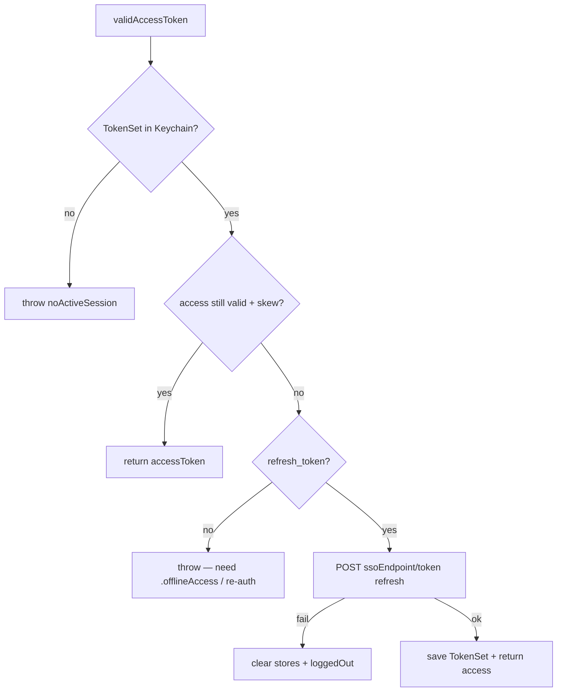

### End-to-end

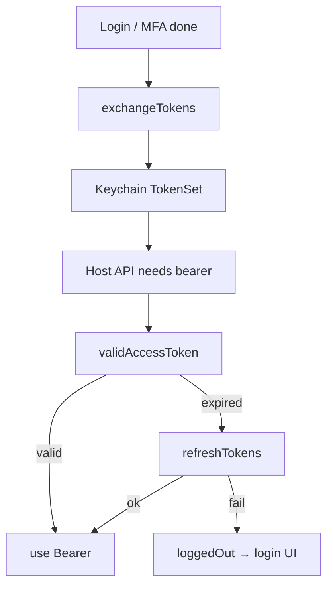

Deep JSON: [services/tokens.md](./services/tokens.md).

### Request / response JSON

#### Exchange — `POST {SSO_X}/token/exchange`

**Encoding:** `application/x-www-form-urlencoded`  
**Headers:** `X-SESSION-ID: {sessionId}`

```
client_id=mobile-app
scope=openid email mobile groups profile offline_access
```

**Response**

```json
{
  "access_token": "eyJhbGciOiJSUzI1NiIs…",
  "id_token": "eyJhbGciOiJSUzI1NiIs…",
  "refresh_token": "ChZKaFlKaDY2dllQ…",
  "token_type": "bearer",
  "expires_in": 86400
}
```

Decoded as `TokenSet` via `JSONDecoder` (Codable). Emits `.tokensUpdated`.

#### Refresh — `POST {SSO}/token`

```
grant_type=refresh_token
refresh_token=…
client_id=mobile-app
scope=openid email mobile groups profile offline_access
```

**Response:** same token object shape. MeeraAuth merges into stored `TokenSet` (keeps refresh token if omitted).

### Listen for token / logout events

```swift
for await event in await auth.events() {
    switch event {
    case .tokensUpdated(let tokens):
        // optional: push tokens.accessToken into TFNetwork / your session
        break
    case .loggedOut:
        // refresh failed or logout — show login
        break
    default:
        break
    }
}
```

### Important

- Host never calls `/token` itself — always go through `AuthClient`
- Host never stores/manages `refresh_token` — MeeraAuth Keychain owns it
- `accessToken()` does **not** refresh; use `validAccessToken()` for live API calls

---

## 9. Logout

```swift
try await auth.logout()
```

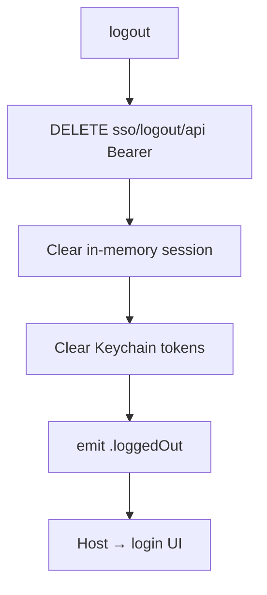

What it does:

1. Best-effort `DELETE {sso}/logout/api` with Bearer access token  
2. Clears in-memory **session**  
3. Clears Keychain **tokens**  
4. Emits `.loggedOut`

Host should then navigate to the login screen.

```swift
Button("Sign out") {
    Task {
        try? await auth.logout()
        coordinator.showLogin()
    }
}
```

Deep JSON: [services/session-logout.md](./services/session-logout.md).

### Session JSON shapes (login / MFA / recovery)

**MFA pending**

```json
{
  "id": "session-id",
  "active": true,
  "authenticatorAssuranceLevel": "aal1",
  "identity": null
}
```

**Complete**

```json
{
  "id": "session-id",
  "authenticatorAssuranceLevel": "aal2",
  "identity": {
    "userId": "…",
    "email": "…",
    "mobile": "…",
    "emailVerified": true,
    "mobileVerified": true
  }
}
```

MeeraAuth: `requiresMFA` ≡ `identity == null`.

**Logout:** `DELETE {SSO}/logout/api` with Bearer access token when available. Response body is not required; local clear always runs.

---

## 10. Forgot / reset password

SSO recovery = prove identity with OTP → get a **session** → open **settings** → set a new password.

There is **no** `LoginStep`-style enum here: each call either **succeeds** or **throws `AuthError`**. Host UI advances on success; maps `error.field` on failure.

### Happy path (copy-paste)

```swift
try await auth.startRecovery()
try await auth.recoverySendCode(option: .email, identifier: email)
_ = try await auth.recoveryVerifyCode(otp)
try await auth.startSettings()
try await auth.settingsUpdatePassword(password: newPass, confirmPassword: newPass)
```

### Step table — what each call does

| # | Call | SSO | Success | Failure (throws) | Host UI next |
|---|------|-----|---------|------------------|--------------|
| 1 | `startRecovery()` | `GET …/recovery/api` | Flow created (internal `flowId`) | Network / recovery disabled | Show “forgot password” form |
| 2 | `recoverySendCode(option:identifier:)` | `POST …/recovery?flow=` | OTP sent; `flowTokenId` stored | Bad identifier, rate limit, unknown user, … | Show OTP screen |
| 3 | `recoveryResendCode()` *(optional)* | `POST …/recovery` (same body + token) | New OTP sent | Too frequent / expired flow | Stay on OTP; toast |
| 4 | `recoveryVerifyCode(otp)` | `POST …/recovery` with `code` | Returns `Session`; saved in session store | Wrong / expired code | Stay on OTP; show error |
| 5 | `startSettings()` | `GET …/settings/api` (+ `X-SESSION-ID`) | Settings flow ready | No session / settings disabled | Show new-password form |
| 6 | `settingsUpdatePassword(password:confirmPassword:)` | `POST …/settings` `method=password` | Password updated | Mismatch, weak password, policy, … | Go to login (or exchange tokens) |

### `recoverySendCode` — `option` switch

| `option` | Identifier | Body fields set | Resource template |
|----------|------------|-----------------|-------------------|
| `.email` | email address | `email` = identifier | `resources.resetEmail` |
| `.phone` | E.164 mobile | `mobile` = identifier | `resources.resetMobile` |
| `.civilId` | Civil ID number | `civilid` = identifier | `resources.resetMobile` |

All three use SSO `method: "captcha"` (OTP strategy name — **not** image captcha UI).

```swift
switch option {
case .email:   // email + resetEmail template
case .phone:   // mobile + resetMobile template
case .civilId: // civilid + resetMobile template
}
```

### Outcome cases (tabular)

| Situation | What happens | Host should |
|-----------|--------------|-------------|
| Valid email/phone + send OK | OTP delivered | Navigate to OTP screen |
| Unknown / invalid identifier | `AuthError` from flow messages | Stay on form; highlight field |
| OTP correct | `Session` returned (`identity` may be present) | Call `startSettings()` |
| OTP wrong / expired | `AuthError` (e.g. code mismatch / expired) | Stay on OTP; allow resend |
| Called verify before send | `.invalidState` (“Send code first”) | Programmer error — fix UI order |
| Called settings without recovery/login session | `.noActiveSession` | Restart recovery or login |
| Passwords don’t match / policy fail | `AuthError` on password fields | Highlight password / confirm |
| Password update OK | Settings flow completes | Login screen **or** `exchangeTokens()` if staying signed in |

### Decision tree

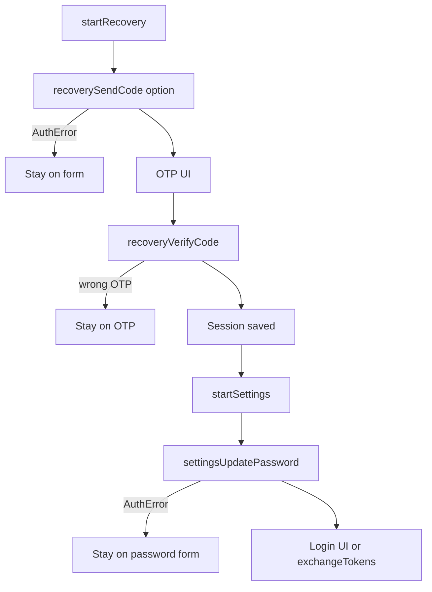

There is **no** `LoginStep`-style enum: each call **succeeds** or **throws `AuthError`**. Host UI advances on success.

Deep JSON: [services/recovery.md](./services/recovery.md).

### Request / response JSON

#### Start — `GET {SSO_X}/recovery/api`

```json
{
  "id": "recovery-flow-id",
  "type": "api",
  "ui": { "forms": [/* email / mobile / civilid */] }
}
```

#### Send code — `POST {SSO_X}/recovery?flow=`

**Email**

```json
{
  "method": "captcha",
  "email": "user@example.com",
  "mobile": "",
  "civilid": "",
  "resource": "{sso}{en}{resetEmailTmpl}"
}
```

**Mobile**

```json
{
  "method": "captcha",
  "email": "",
  "mobile": "+9689xxxxxxx",
  "civilid": "",
  "resource": "{sso}{en}{resetMobileTmpl}"
}
```

**Civil ID**

```json
{
  "method": "captcha",
  "email": "",
  "mobile": "",
  "civilid": "12345678",
  "resource": "{sso}{en}{resetMobileTmpl}"
}
```

#### Verify code

```json
{
  "code": "123456",
  "flowTokenId": "…",
  "method": "captcha"
}
```

**Response:** session JSON → MeeraAuth saves and returns `Session`. Then `startSettings()` + password update (see **Settings password JSON** below).

### Sequence (happy path)

```swift
try await auth.startRecovery()
try await auth.recoverySendCode(option: .email, identifier: email)
_ = try await auth.recoveryVerifyCode(otp)
try await auth.startSettings()
try await auth.settingsUpdatePassword(password: newPass, confirmPassword: newPass)
```

### Step A — Recovery (code)

```swift
try await auth.startRecovery()

try await auth.recoverySendCode(
    option: .email,                 // or .phone / .civilId
    identifier: "user@example.com"
)

try await auth.recoveryResendCode()   // optional

let session = try await auth.recoveryVerifyCode(otpCode)
```

### Step B — Set new password (settings)

Requires the **session from recovery** (or a normal login session):

```swift
try await auth.startSettings()

try await auth.settingsUpdatePassword(
    password: newPassword,
    confirmPassword: newPasswordAgain
)

// Optional: if you keep the user signed in
let tokens = try await auth.exchangeTokens()
```

**Senior rule:** recovery proves who you are (OTP → session); settings changes the secret (password). Do not skip `startSettings()` between verify and update.

### Settings password JSON (after recovery)

#### Start — `GET {SSO_X}/settings/api`

**Headers:** `X-SESSION-ID`, optional `Authorization: Bearer`

```json
{
  "id": "settings-flow-id",
  "type": "api",
  "ui": { "forms": [/* password, civilid, … */] }
}
```

#### Update password — `POST {SSO_X}/settings?flow=`

```json
{
  "method": "password",
  "password": "••••••••",
  "confirmPassword": "••••••••"
}
```

---

## 11. Update / reset email (settings)

Requires an authenticated session (login **or** recovery).

### Decision tree

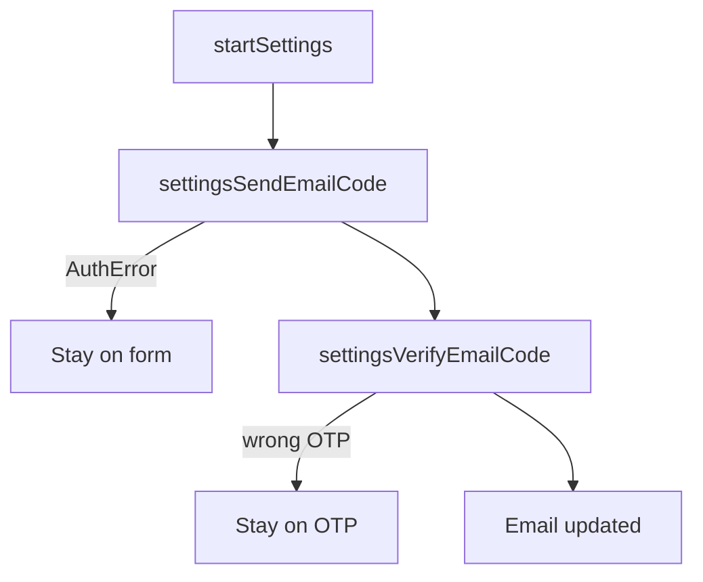

```swift
try await auth.startSettings()

// Send OTP to the new email
try await auth.settingsSendEmailCode("new@example.com")

// User enters OTP
try await auth.settingsVerifyEmailCode(otpCode)
```

Uses `resources.activeEmail` (locale injected → e.g. `{sso}{en}{activeEmailTmpl}`).

### Request / response JSON

**Send email code**

```json
{
  "method": "civilid",
  "email": "user@example.com",
  "resource": "{sso}{en}{emailOtpTmpl}"
}
```

**Verify email / mobile code**

```json
{
  "method": "civilid",
  "code": "123456",
  "flowTokenId": "…"
}
```

---

## 12. Update mobile (settings)

Requires an authenticated session (login **or** recovery). Each call **succeeds** or **throws `AuthError`**.

### Decision tree


Uses `resources.activeMobile` (locale injected → e.g. `{sso}{en}{activeMobileTmpl}`).

### Sequence (happy path)

```swift
try await auth.startSettings()

try await auth.settingsSendMobileCode(
    mobile: "+9689xxxxxxx",
    username: optionalUsername,   // if required by product
    civilIdUpdate: true,
    useCivilIDMobile: true
)

try await auth.settingsVerifyMobileCode(otpCode)
```

### Request / response JSON

**Send mobile code**

```json
{
  "method": "civilid",
  "mobile": "+9689xxxxxxx",
  "resource": "{sso}{en}{mobileOtpTmpl}",
  "civilIdUpdate": true,
  "useCivilIDMobile": true,
  "username": "optional"
}
```

**Verify** — same shape as email verify (`method` + `code` + `flowTokenId`).

---

## 13. Verification (activate email / mobile)

For activating an unverified email/mobile **outside** full settings Civil ID bind (verification flow). Each call **succeeds** or **throws `AuthError`**.

### Decision tree

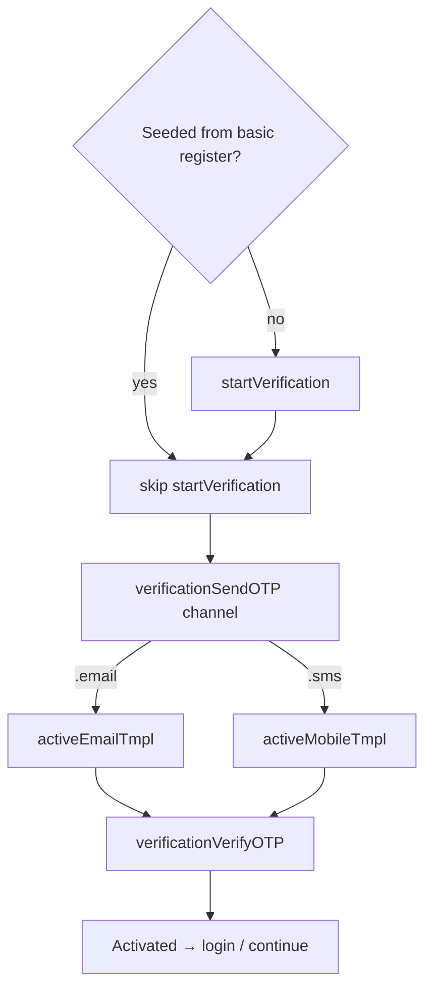

| Channel | Resource |
|---------|----------|
| `.email` | `activeEmail` |
| `.sms` | `activeMobile` |

**Channel ownership:** host picks email/SMS here. Login MFA channel is **server** `active` — see [§7](#7-mfa-second-factor).

Deep JSON: [services/verification.md](./services/verification.md).

### Sequence (happy path)

```swift
try await auth.startVerification()

try await auth.verificationSendOTP(
    channel: .email,              // or .sms
    identifier: "user@example.com"
)

try await auth.verificationResendOTP()   // optional
try await auth.verificationVerifyOTP(code)
```

### Request / response JSON

#### Start — `GET {SSO_X}/verification/api` (when not seeded)

```json
{
  "id": "verification-flow-id",
  "type": "api",
  "state": "choose_method",
  "ui": {
    "forms": [
      {
        "nodes": [
          {
            "attributes": {
              "id": "method",
              "name": "method",
              "value": "captcha"
            }
          }
        ]
      }
    ]
  }
}
```

SSO uses `"method": "captcha"` in App Client payloads (not an image-captcha UI in MeeraAuth).

#### Send OTP

**Email**

```json
{
  "method": "captcha",
  "email": "user@example.com",
  "resource": "{sso}{en}{activeEmailTmpl}"
}
```

**SMS**

```json
{
  "method": "captcha",
  "mobile": "+9689xxxxxxx",
  "resource": "{sso}{en}{activeMobileTmpl}"
}
```

**Response:** flow with `flowTokenId` in `ui` nodes.

#### Verify OTP

```json
{
  "method": "captcha",
  "code": "123456",
  "flowTokenId": "…"
}
```

Do not send email/mobile on verify.

---

## 14. Civil ID bind (settings)

Requires an authenticated **session** (login or recovery). Each call **succeeds** or **throws `AuthError`** — no step enum.

### Decision tree

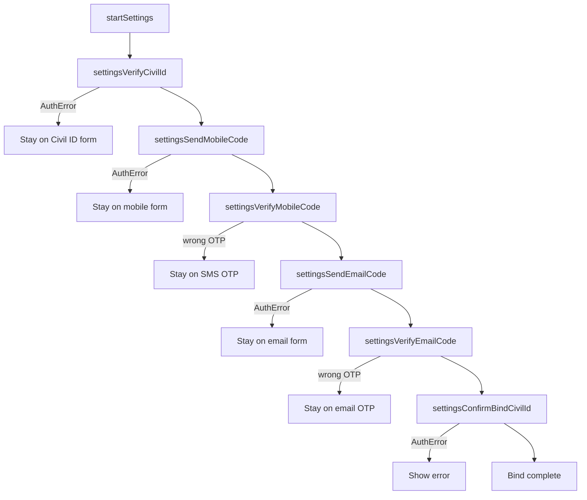

Product may omit mobile or email steps depending on SSO requirements; keep call order as your product flow defines.

Deep JSON: [services/settings.md](./services/settings.md).

### Sequence (happy path)

```swift
try await auth.startSettings()

try await auth.settingsVerifyCivilId(civilId, expiry: "2030-12-31")

try await auth.settingsSendMobileCode(mobile: mobile, …)
try await auth.settingsVerifyMobileCode(smsOTP)

try await auth.settingsSendEmailCode(email)
try await auth.settingsVerifyEmailCode(emailOTP)

try await auth.settingsConfirmBindCivilId()
```

### Request / response JSON

#### Verify Civil ID

```json
{
  "method": "civilid",
  "civilId": "12345678",
  "civilIdExpiry": "2026-01-01"
}
```

#### Send mobile / email / verify

Same bodies as [§12](#12-update-mobile-settings) / [§11](#11-update--reset-email-settings) (`method: "civilid"`, resource templates, then `code` + `flowTokenId`).

#### Confirm bind

```json
{
  "method": "civilid"
}
```

Deep JSON: [services/settings.md](./services/settings.md).

---

## 15. Cold start & session helpers

```mermaid
flowchart TD
  A[App launch] --> B{currentTokens?}
  B -->|yes| C[validAccessToken for APIs]
  C --> D[Home / authenticated UI]
  B -->|no| E[Login UI]
  E --> F[startLogin → login → MFA? → exchangeTokens]
  F --> D
```

```swift
// Already signed in?
if let tokens = try await auth.currentTokens() {
    showHome(accessToken: tokens.accessToken)
} else {
    showLogin()
}

let bearer = try await auth.accessToken()
let session = try await auth.currentSession()
```

Prefer `validAccessToken()` over `accessToken()` when calling APIs — see [§8](#8-token-exchange-refresh--using-the-access-token).

| Store | Data | Survives relaunch? |
|-------|------|---------------------|
| `InMemorySessionStore` | SSO session id | No |
| `KeychainTokenStore` | access/refresh tokens | Yes (`{bundleId}.auth.tokens`) |

---

## 16. Events

```swift
Task {
    for await event in await auth.events() {
        switch event {
        case .loggedIn(let session): break
        case .loggedOut: break
        case .tokensUpdated(let tokens): break
        case .sessionUpdated(let session): break
        }
    }
}
```

---

## 17. Errors

```swift
public struct AuthError: Error {
    public let code: AuthErrorCode
    public let message: String
    public let httpStatus: Int?
    public let field: AuthField?   // .email .phone .password .civilId .otp .general
    public let context: [String: String]
}
```

```swift
catch let error as AuthError {
    switch error.code {
    case .passwordMismatch: break
    case .flowExpired: break
    default: break
    }
    alert = error.localizedDescription   // catalog (en / ar / ar-OM)
    // log(error.message)                // SSO raw text
}
```

| Property | Use for |
|----------|---------|
| `error.code` | Switch / behavior |
| `error.localizedDescription` | User-facing UI (``LocalizedError``) |
| `error.message` | Server / SSO raw string (logs) |
| `error.field` | Optional form placement |
| `error.retryable` | Restart flow / retry |

| Code / factory | Meaning |
|----------------|---------|
| 6051 | Password mismatch |
| 6050 | Identity not found |
| 6064 | OTP mismatch |
| 6066 | OTP expired |
| 6070 | OTP send too frequently |
| 6001 | No active session |
| 6014 | Registration disabled (SSO) |
| `AuthError.methodDisabled` | Login option not in `loginOptions` (client; SSO not called) |
| `AuthError.signupDisabled` / `signupMethodDisabled` | Signup off or path not in `signupOptions` (client; SSO not called) |

`error.retryable` — network / rate limit / expired flow.  
`error.isInformationalOTP` — code sent/resent (not a hard failure).  
Allow-list errors use `code: .methodDisabled` and `context["fault"]` of `host.loginOptions` or `host.signupOptions`.

### Host localization

``AuthError`` conforms to `LocalizedError`. UI strings follow **`AuthConfiguration.locale`** (synced into ``AuthLocalization`` when `AuthClient` is created) — not the phone language.

```swift
// HostAppApp: locale: .arabic  → Arabic alerts even if device is English
catch let error as AuthError {
    showAlert(error.localizedDescription)  // uses AuthLocalization.locale
    // error.message                       // SSO raw English
    // error.localizedDescription(for: .english)  // explicit override
}

// If the user switches language in-app later:
AuthLocalization.locale = .arabic
```

Catalog: package `Resources/AuthErrorCatalog.json` (`en` / `ar` / `ar-OM`).  
Optional helper: ``AuthErrorPresenter.present(_:)``.

---

## 18. Network logging

Host-controlled curl logs:

```swift
networkLogging: .off
networkLogging: .log       // structured + redacts secrets
networkLogging: .verbose   // structured + full curl (DEBUG)
networkLogging: .curl      // curl command only (copy-paste)
```

Example:

```text
━━━━━━━━ MeeraAuth · START · log ━━━━━━━━
→ REQUEST
POST https://sso…/x/login?flow=…
$ curl -v \
	-X POST \
	-H "Content-Type: application/json" \
	-d "{…}" \
	"https://sso…/x/login?flow=…"

← RESPONSE  HTTP 200 · 42ms · 348 B
{…}
━━━━━━━━━━━━ MeeraAuth · END ━━━━━━━━━━━━
```

---

## 19. MVI pattern

Same shape as Mirsad Auth:

```mermaid
flowchart LR
  V[View] -->|send| S[Store]
  S --> R[Reducer]
  R -->|Effect?| H[EffectHandler]
  H -->|AuthClient| A[Action?]
  A --> S
```

Sample: `HostApp/HostApp/Features/Auth/` (login MVI + Civil ID signup gated by `signupOptions`).

---

## 20. API quick reference

### Registration

Requires non-empty `signupOptions`. `.basic` unlocks `register`; `.civilId` unlocks the Civil ID wizard APIs.

| Method | Purpose |
|--------|---------|
| `startRegistration()` | Create registration flow (**required** first; fails if `signupOptions` empty) |
| `register(_:)` | Basic password signup → `RegistrationStep` (needs `.basic`) |
| `verifyRegistrationCivilId(_:expiry:)` | Civil ID step (needs `.civilId`) |
| `sendRegistrationMobileOTP(...)` / `resendRegistrationMobileOTP()` | Civil ID mobile OTP |
| `verifyRegistrationMobileOTP(_:)` | Confirm mobile OTP |
| `sendRegistrationEmailOTP(_:)` / `resendRegistrationEmailOTP()` | Civil ID email OTP |
| `verifyRegistrationEmailOTP(_:)` | Confirm email OTP |
| `submitRegistrationPassword(password:confirmPassword:)` | Finish Civil ID signup → `RegistrationStep` |

### Login

| Method | Purpose |
|--------|---------|
| `startLogin()` | Create login flow (**required** first) |
| `login(option:identifier:password:)` | Submit credentials → `LoginStep` |
| `sendLoginMFA()` / `resendLoginMFA()` | Send / resend MFA OTP |
| `verifyLoginMFA(code:)` | Complete MFA → `Session` |
| `exchangeTokens()` | Session → OAuth tokens |

### Logout

| Method | Purpose |
|--------|---------|
| `logout()` | SSO logout + clear session + clear tokens |

### Forgot / reset password

| Method | Purpose |
|--------|---------|
| `startRecovery()` | Create recovery flow |
| `recoverySendCode(option:identifier:)` | Send reset OTP (email/phone) |
| `recoveryResendCode()` | Resend OTP |
| `recoveryVerifyCode(_:)` | Verify OTP → session |
| `startSettings()` | Open settings with session |
| `settingsUpdatePassword(password:confirmPassword:)` | Set new password |

### Email / mobile settings

| Method | Purpose |
|--------|---------|
| `settingsSendEmailCode(_:)` | OTP to new email |
| `settingsVerifyEmailCode(_:)` | Confirm email |
| `settingsSendMobileCode(...)` | OTP to mobile |
| `settingsVerifyMobileCode(_:)` | Confirm mobile |

### Verification

| Method | Purpose |
|--------|---------|
| `startVerification()` | Create verification flow |
| `verificationSendOTP(channel:identifier:)` | Send activate OTP |
| `verificationResendOTP()` | Resend |
| `verificationVerifyOTP(_:)` | Verify |

### Civil ID

| Method | Purpose |
|--------|---------|
| `settingsVerifyCivilId(_:expiry:)` | Validate Civil ID |
| `settingsConfirmBindCivilId()` | Confirm bind |

### Session / tokens

| Method | Purpose |
|--------|---------|
| `currentSession()` | In-memory session |
| `currentTokens()` / `accessToken()` | Keychain tokens (may be expired) |
| `validAccessToken(skew:)` | Fresh access token; refreshes when needed |
| `refreshTokens()` | Force OAuth refresh; clears + `.loggedOut` on failure |
| `events()` | `AsyncStream<AuthEvent>` |

### `LoginStep`

```swift
enum LoginStep {
    case requiresMFA(channel: MFAChannel, sessionId: String)
    case authenticated(Session)
}
```

### `RegistrationStep`

```swift
enum RegistrationStep {
    case requiresVerification
    case completed(Session?)
}
```

---

## 21. Host checklist

1. Add SPM `MeeraAuth` + inject `AuthHTTPClient`
2. Pass `clientId`, `scopes`, `locale`, `loginOptions`, endpoints
3. Set `signupOptions` for this product (`[]` = no signup; `[.basic]` / `[.civilId]` / both). Gate signup UI from `auth.configuration.signupOptions`
4. Signup (if enabled): `startRegistration` → basic `register` **or** Civil ID wizard → verification / navigate to login (do not auto-exchange when session is nil)
5. Login: `startLogin` → `login` → MFA if needed → `exchangeTokens`
6. Logout: `logout()` then show login UI
7. Forgot password: recovery OTP → `settingsUpdatePassword`
8. Update email/mobile via settings OTP APIs
9. Gate app with `currentTokens()` on cold start
10. Call backends with `try await auth.validAccessToken()` (auto-refresh)
11. Map `AuthError.field` to form fields
12. Enable `.verbose` network logs only in DEBUG
13. Include `.offlineAccess` so refresh tokens are issued

---

## Sample HostApp

```bash
cd HostApp
open HostApp.xcworkspace
```

Configure in `HostAppApp.swift` (direct `AuthClient` + `AuthConfiguration`) and `AuthEnvironment.swift`.

---

## Related SSO docs

Upstream API dumps live at the repo root (not inside the package):

| File | Topic |
|------|--------|
| [docs/sso-reference/x-login-flow.md](../../../docs/sso-reference/x-login-flow.md) | Login + MFA |
| [docs/sso-reference/x-register-flow.md](../../../docs/sso-reference/x-register-flow.md) | Basic registration |
| [docs/sso-reference/x-register-flow-civilid.md](../../../docs/sso-reference/x-register-flow-civilid.md) | Civil ID registration |
| [docs/sso-reference/x-recovery-flow.md](../../../docs/sso-reference/x-recovery-flow.md) | Forgot password → session |
| [docs/sso-reference/x-verification-flow.md](../../../docs/sso-reference/x-verification-flow.md) | Activate email/mobile |
| [docs/sso-reference/x-setting-flow-civilid.md](../../../docs/sso-reference/x-setting-flow-civilid.md) | Settings / Civil ID / password form |

---

## Minimal end-to-end (login + logout)

```swift
import MeeraAuth

let auth = AuthClient(
    configuration: AuthConfiguration(
        ssoEndpoint: URL(string: "https://sso.test10.meeraspace.com")!,
        ssoXEndpoint: URL(string: "https://sso.test10.meeraspace.com/x")!,
        clientId: .mobileApp,
        scopes: [.openid, .email, .mobile, .groups, .profile, .offlineAccess],
        locale: .english,
        loginOptions: [.email, .phone, .civilId],
        signupOptions: [.basic, .civilId],
        resources: AuthResourceTemplates(
            emailOTP: "{sso}{emailOtpTmpl}",
            mobileOTP: "{sso}{mobileOtpTmpl}",
            resetEmail: "{sso}{resetEmailTmpl}",
            resetMobile: "{sso}{resetMobileTmpl}",
            activeEmail: "{sso}{activeEmailTmpl}",
            activeMobile: "{sso}{activeMobileTmpl}"
        )
    ),
    httpClient: URLSessionAuthHTTPClient()
)

// Login
try await auth.startLogin()
let step = try await auth.login(option: .email, identifier: email, password: password)
if case .requiresMFA = step {
    _ = try await auth.verifyLoginMFA(code: otp)
}
let tokens = try await auth.exchangeTokens()
print(tokens.accessToken)

// Logout
try await auth.logout()
```

## Minimal forgot password

```swift
try await auth.startRecovery()
try await auth.recoverySendCode(option: .email, identifier: email)
_ = try await auth.recoveryVerifyCode(otp)
try await auth.startSettings()
try await auth.settingsUpdatePassword(password: newPass, confirmPassword: newPass)
```

---

## 22. Service docs (JSON + HTTP)

Per-flow **AuthClient → HTTP → Mermaid decision tree → sample Swift → JSON**:

**→ [Docs/services/](./services/)**

| Doc | Topic |
|-----|--------|
| [login.md](./services/login.md) | AAL1 + AAL2 MFA; channel from server `active` only |
| [registration.md](./services/registration.md) | Basic + Civil ID signup |
| [verification.md](./services/verification.md) | Activate email / mobile (host picks channel) |
| [recovery.md](./services/recovery.md) | Forgot password → settings password |
| [tokens.md](./services/tokens.md) | Exchange + refresh |
| [settings.md](./services/settings.md) | Password, Civil ID bind, email/mobile |
| [session-logout.md](./services/session-logout.md) | Session helpers + logout |
