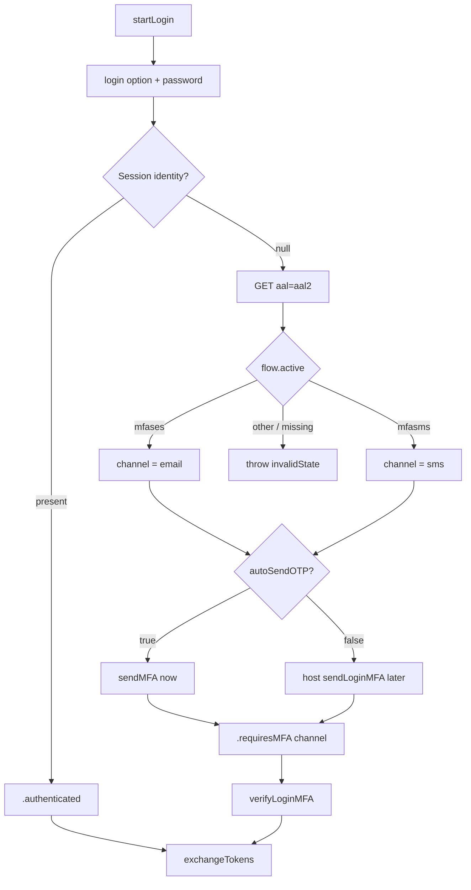

# Login service (AAL1 + AAL2 MFA)

**AuthClient:** `AuthClient+Login`  
**Domain:** `LoginFlowService` · **Requests:** `LoginRequest`  
**SSO ref:** [x-login-flow.md](../../../docs/sso-reference/x-login-flow.md) (App Client)

---

## 1. Purpose

Sign the user in with email / phone / Civil ID + password. If SSO requires a second factor, complete MFA OTP, then exchange the session for tokens.

---

## 2. AuthClient APIs

| Method | Role |
|--------|------|
| `startLogin()` | Create login flow |
| `login(option:identifier:password:)` | AAL1 submit; may start MFA |
| `sendLoginMFA()` | Send OTP (when `autoSendOTP == false`) |
| `resendLoginMFA()` | Resend OTP |
| `verifyLoginMFA(code:)` | Complete AAL2 → `Session` |
| `exchangeTokens()` | Session → access / refresh tokens |

---

## 3. Prerequisites

```swift
AuthConfiguration(
    …
    loginOptions: [.email, .phone, .civilId],  // must include the option you call
    scopes: […, .offlineAccess],               // for refresh_token
    mfaPolicy: MFAPolicy(autoSendOTP: true)    // when to send OTP — not where
)
```

| Config | Effect |
|--------|--------|
| `loginOptions` | Allow-list for `login(option:)` |
| `MFAPolicy.autoSendOTP` | `true` → send OTP inside `login` after AAL2 flow; `false` → host calls `sendLoginMFA()` |
| MFA **channel** | **Not** configurable — from SSO AAL2 `"active"` only |

---

## 4. Sequence

| Step | AuthClient | HTTP |
|------|------------|------|
| 1 | `startLogin()` | `GET {SSO_X}/login/api` |
| 2 | `login(…)` | `POST {SSO_X}/login?flow={loginFlowId}` |
| 3a | *(inside login if MFA)* | `GET {SSO_X}/login/api?aal=aal2` + `X-SESSION-ID` |
| 3b | *(if autoSendOTP)* | `POST {SSO_X}/login?flow={mfaFlowId}` send OTP |
| 4 | `sendLoginMFA` / `resendLoginMFA` | same POST (if needed) |
| 5 | `verifyLoginMFA(code:)` | `POST {SSO_X}/login?flow={mfaFlowId}` |
| 6 | `exchangeTokens()` | `POST {SSO_X}/token/exchange` + `X-SESSION-ID` |

---

## 5. Decision tree



**Channel rule:** Server `active` decides destination. `autoSendOTP` only decides **when** the first send runs.

---

## 6. Sample host Swift

```swift
try await auth.startLogin()

let step = try await auth.login(
    option: .email,
    identifier: email,
    password: password
)

switch step {
case .authenticated:
    let tokens = try await auth.exchangeTokens()
    // use tokens.accessToken

case .requiresMFA(let channel, _):
    // channel == .email or .sms — from server active
    // OTP already sent if MFAPolicy(autoSendOTP: true)
    // else: try await auth.sendLoginMFA()

    _ = try await auth.verifyLoginMFA(code: otp)
    let tokens = try await auth.exchangeTokens()
}
```

---

## 7. Request / response JSON

### 7.1 Start — `GET {SSO_X}/login/api`

**Response (trimmed)**

```json
{
  "id": "login-flow-id",
  "type": "api",
  "active": "password",
  "ui": { "forms": [/* password nodes */] },
  "expiresAt": "2025-09-11T08:00:00Z",
  "issuedAt": "2025-09-11T07:00:00Z"
}
```

MeeraAuth stores `id` as login `flowId`.

---

### 7.2 Submit credentials — `POST {SSO_X}/login?flow={loginFlowId}`

**Request (email)**

```json
{
  "email": "user@example.com",
  "mobile": "",
  "password": "••••••••",
  "method": "password"
}
```

(`phone` → `mobile` filled; `civilId` → `civilId` + `"method": "civilid"`.)

**Response — MFA required**

```json
{
  "id": "iTSf98STCqMuzznPPeMkKb",
  "userId": "3d88Accd7C8uURsdmXnTrV",
  "active": true,
  "authenticatorAssuranceLevel": "aal1",
  "authenticationMethods": [
    { "method": "password", "aal": "aal1", "completed_at": "…" }
  ],
  "identity": null
}
```

- `id` → session id (`X-SESSION-ID`)
- `identity: null` → MFA required (`Session.requiresMFA`)
- Here `active` is a **bool**, not MFA method

**Response — no MFA:** same shape with non-null `identity` → `.authenticated`.

---

### 7.3 AAL2 flow — `GET {SSO_X}/login/api?aal=aal2`

**Headers:** `X-SESSION-ID: {sessionId}`

**Response — email MFA**

```json
{
  "id": "bKeuKkZoPSzPtjUHwLnv4q",
  "type": "api",
  "active": "mfases",
  "requestedAal": "aal2",
  "ui": {
    "forms": [
      {
        "id": "mfases",
        "nodes": [
          { "attributes": { "id": "email", "name": "email", "value": "user@example.com" } },
          { "attributes": { "id": "method", "name": "method", "value": "mfases" } }
        ]
      }
    ]
  }
}
```

**SMS MFA:** `"active": "mfasms"` (+ `mobile` node).

| `active` | Channel | OTP |
|----------|---------|-----|
| `mfases` | `.email` | Email |
| `mfasms` | `.sms` | SMS |
| other | — | `AuthError.invalidState` |

---

### 7.4 Send MFA — `POST {SSO_X}/login?flow={mfaFlowId}`

**Headers:** `Content-Type: application/json`, `X-SESSION-ID`

**Email**

```json
{
  "method": "mfases",
  "resource": "{sso}{en}{emailOtpTmpl}",
  "email": "user@example.com"
}
```

**SMS**

```json
{
  "method": "mfasms",
  "resource": "{sso}{en}{mobileOtpTmpl}",
  "mobile": "+9689xxxxxxx"
}
```

(Resend also sends `flowTokenId` when already known.)

**Response:** flow with `flowTokenId` node — MeeraAuth stores it for verify.

---

### 7.5 Verify MFA — `POST {SSO_X}/login?flow={mfaFlowId}`

**Email**

```json
{
  "resource": "{sso}{en}{emailOtpTmpl}",
  "method": "mfases",
  "flowTokenId": "7xgwKCkkS4mt6G8VNaMvDE",
  "code": "8572"
}
```

**SMS**

```json
{
  "method": "mfasms",
  "flowTokenId": "ER5Ry2BtkEaz5TbNWXQRRw",
  "code": "2749"
}
```

No `email` / `mobile` on verify.

**Success (trimmed)**

```json
{
  "id": "iTSf98STCqMuzznPPeMkKb",
  "authenticatorAssuranceLevel": "aal2",
  "authenticationMethods": [
    { "method": "password", "aal": "aal1" },
    { "method": "mfases", "aal": "aal2" }
  ],
  "identity": {
    "userId": "…",
    "email": "user@example.com",
    "mobile": "+9689xxxxxxx",
    "emailVerified": true,
    "mobileVerified": true
  }
}
```

Then [tokens.md](./tokens.md).

---

## 8. Errors

| Situation | Handling |
|-----------|----------|
| Bad password / validation | SSO `ui` / form `messages` → `AuthError` via `ErrorMapper` |
| Option not in `loginOptions` | Client `AuthError.methodDisabled` (no SSO call) |
| Unknown AAL2 `active` | `AuthError.invalidState` |
| Verify without send | `invalidState` — missing `flowTokenId` / channel |
| MFA incomplete (`identity` still null) | `aalNotSatisfied` |

---

## 9. Notes

- Login option (email/phone/civilId) is **first factor only** — not MFA channel.
- MeeraAuth caches `flowId`, `flowTokenId`, `mfaChannel` inside `LoginFlowService` for the actor lifetime of the flow.
- After `.requiresMFA`, a partial session (`identity: nil`) is saved so MFA calls have a session id.
