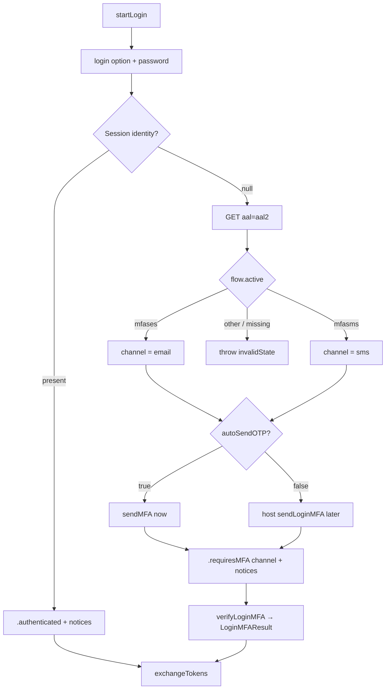

# Login service (AAL1 + AAL2 MFA)

**AuthClient:** `AuthClient+Login`  
**Domain:** `LoginFlowService` · **Requests:** `LoginRequest`  
**SSO ref:** [x-login-flow.md](../../../docs/sso-reference/x-login-flow.md) (App Client)

---

## 1. Purpose

Sign the user in with email / phone / Civil ID + password. If SSO requires a second factor, complete MFA OTP, then exchange the session for tokens.

---

## 2. AuthClient APIs

| Method | Role | Returns |
|--------|------|---------|
| `startLogin()` | Create login flow | — |
| `login(option:identifier:password:)` | AAL1 submit; may start MFA | `LoginStep` |
| `sendLoginMFA()` | Send OTP (when `autoSendOTP == false`) | `[AuthFlowNotice]` |
| `resendLoginMFA()` | Resend OTP | `[AuthFlowNotice]` |
| `verifyLoginMFA(code:)` | Complete AAL2 | `LoginMFAResult` (`session` + `notices`) |
| `exchangeTokens()` | Session → access / refresh tokens | `TokenSet` |

### `LoginStep`

```swift
enum LoginStep {
    case requiresMFA(channel: MFAChannel, sessionId: String, notices: [AuthFlowNotice])
    case authenticated(session: Session, notices: [AuthFlowNotice])
}
```

- `.requiresMFA` `notices` — from auto-send OTP when `autoSendOTP == true` (else often `[]`)
- `.authenticated` `notices` — info messages on the session/flow payload when present (else `[]`)

---

## 3. Prerequisites

```swift
AuthConfiguration(
    …
    loginOptions: [.email, .phone, .civilId],  // must include the option you call
    scopes: […, .offlineAccess],               // for refresh_token
    mfaPolicy: MFAPolicy(autoSendOTP: true)    // when to send OTP — not where
)
```

| Config | Effect |
|--------|--------|
| `loginOptions` | Allow-list for `login(option:)` |
| `MFAPolicy.autoSendOTP` | `true` → send OTP inside `login` after AAL2 flow; `false` → host calls `sendLoginMFA()` |
| MFA **channel** | **Not** configurable — from SSO AAL2 `"active"` only |

---

## 4. Sequence

| Step | AuthClient | HTTP |
|------|------------|------|
| 1 | `startLogin()` | `GET {SSO_X}/login/api` |
| 2 | `login(…)` | `POST {SSO_X}/login?flow={loginFlowId}` |
| 3a | *(inside login if MFA)* | `GET {SSO_X}/login/api?aal=aal2` + `X-SESSION-ID` |
| 3b | *(if autoSendOTP)* | `POST {SSO_X}/login?flow={mfaFlowId}` send OTP |
| 4 | `sendLoginMFA` / `resendLoginMFA` | same POST (if needed) |
| 5 | `verifyLoginMFA(code:)` | `POST {SSO_X}/login?flow={mfaFlowId}` |
| 6 | `exchangeTokens()` | `POST {SSO_X}/token/exchange` + `X-SESSION-ID` |

---

## 5. Decision tree


```mermaid
flowchart TD
  A[startLogin] --> B[login option + password]
  B --> C{Session identity?}
  C -->|present| D[.authenticated + notices]
  D --> E[exchangeTokens]
  C -->|null| F[GET aal=aal2]
  F --> G{flow.active}
  G -->|mfases| H[channel = email]
  G -->|mfasms| I[channel = sms]
  G -->|other / missing| J[throw invalidState]
  H --> K{autoSendOTP?}
  I --> K
  K -->|true| L[sendMFA now]
  K -->|false| M[host sendLoginMFA later]
  L --> N[.requiresMFA channel + notices]
  M --> N
  N --> O[verifyLoginMFA → LoginMFAResult]
  O --> E
```

**Channel rule:** Server `active` decides destination. `autoSendOTP` only decides **when** the first send runs.

---

## 6. Sample host Swift

```swift
try await auth.startLogin()

let step = try await auth.login(
    option: .email,
    identifier: email,
    password: password
)

switch step {
case .authenticated(let session, let notices):
    // optional: show notices.first?.localizedDescription
    let tokens = try await auth.exchangeTokens()

case .requiresMFA(let channel, let sessionId, let notices):
    // channel == .email or .sms — from server active
    // notices from auto-send when MFAPolicy(autoSendOTP: true)
    // else: let notices = try await auth.sendLoginMFA()

    let result = try await auth.verifyLoginMFA(code: otp)
    // result.session, result.notices
    let tokens = try await auth.exchangeTokens()
}
```

Notices vs errors: see [services README — AuthFlowNotice](./README.md#authflownotice).

---

## 7. Request / response JSON

### 7.1 Start — `GET {SSO_X}/login/api`

**Response (trimmed)**

```json
{
  "id": "login-flow-id",
  "type": "api",
  "active": "password",
  "ui": { "forms": [/* password nodes */] },
  "expiresAt": "2025-09-11T08:00:00Z",
  "issuedAt": "2025-09-11T07:00:00Z"
}
```

MeeraAuth stores `id` as login `flowId`.

---

### 7.2 Submit credentials — `POST {SSO_X}/login?flow={loginFlowId}`

**Request (email)**

```json
{
  "email": "user@example.com",
  "mobile": "",
  "password": "••••••••",
  "method": "password"
}
```

(`phone` → `mobile` filled; `civilId` → `civilId` + configured Civil ID method.)

**Response — MFA required**

```json
{
  "id": "iTSf98STCqMuzznPPeMkKb",
  "userId": "3d88Accd7C8uURsdmXnTrV",
  "active": true,
  "authenticatorAssuranceLevel": "aal1",
  "authenticationMethods": [
    { "method": "password", "aal": "aal1", "completed_at": "…" }
  ],
  "identity": null
}
```

- `id` → session id (`X-SESSION-ID`)
- `identity: null` → MFA required (`Session.requiresMFA`)
- Here `active` is a **bool**, not MFA method

**Response — no MFA:** same shape with non-null `identity` → `.authenticated(session:notices:)`.

---

### 7.3 AAL2 flow — `GET {SSO_X}/login/api?aal=aal2`

**Headers:** `X-SESSION-ID: {sessionId}`

**Response — email MFA:** `active: "mfases"` → channel `.email`  
**Response — SMS MFA:** `active: "mfasms"` → channel `.sms`

---

### 7.4 Send / resend OTP

Info messages (e.g. code `6062`) become `[AuthFlowNotice]`, not thrown errors.

---

### 7.5 Verify MFA

Returns `LoginMFAResult(session:notices:)`. Errors still throw `AuthError`.

---

## 8. Errors

| Situation | Behavior |
|-----------|----------|
| Bad password / validation | SSO `type: "error"` messages → `AuthError` |
| Info / success messages | `type: "info"` / `"success"` → `AuthFlowNotice` |
| Missing MFA `active` | `invalidState` |
| Option not in `loginOptions` | `methodDisabled` before SSO |

After `.requiresMFA`, a partial session (`identity: nil`) is saved so MFA calls have a session id.
