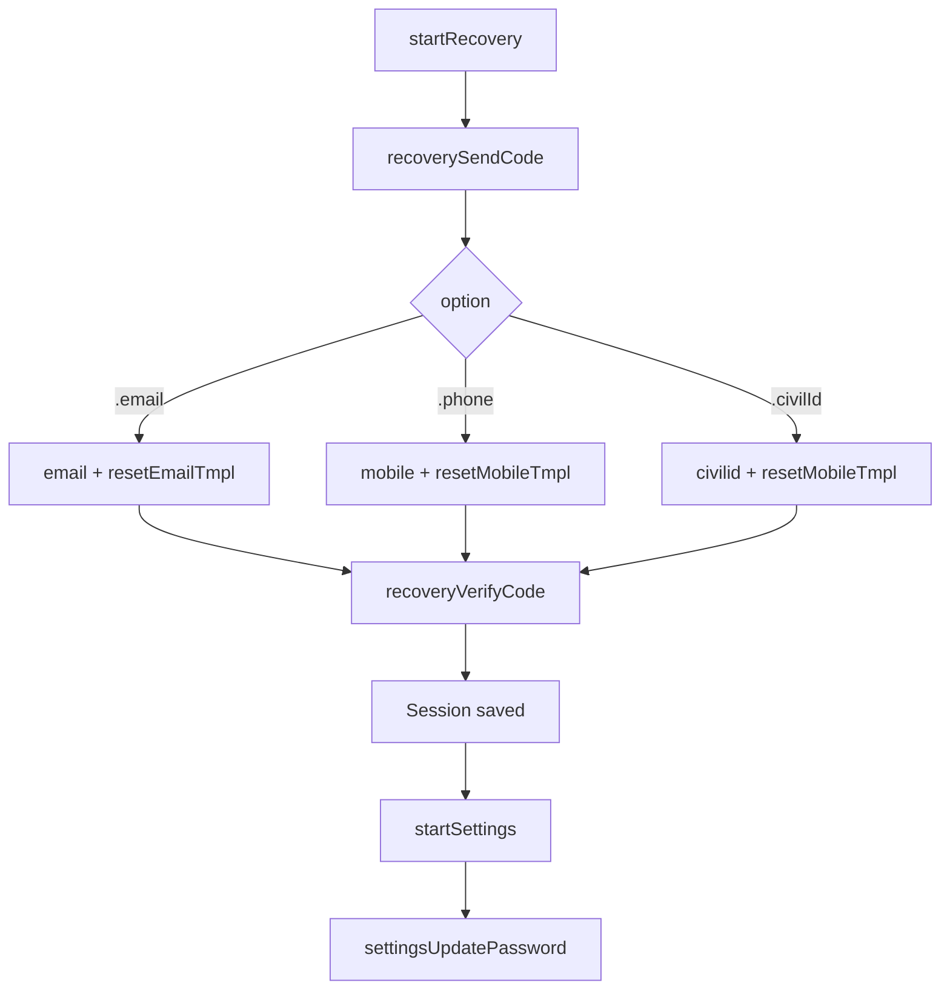

# Recovery service (forgot password)

**AuthClient:** `AuthClient+Recovery` (+ password via Settings)  
**Domain:** `RecoveryFlowService` · **Requests:** `RecoveryRequest`  
**SSO ref:** [x-recovery-flow.md](../../../docs/sso-reference/x-recovery-flow.md)

---

## 1. Purpose

Prove identity with OTP (email / mobile / Civil ID), obtain a session, then set a new password via settings.

---

## 2. AuthClient APIs

| Method | Role |
|--------|------|
| `startRecovery()` | Create recovery flow |
| `recoverySendCode(option:identifier:)` | Send OTP |
| `recoveryResendCode()` | Resend |
| `recoveryVerifyCode(_:)` | → `Session` |
| `startSettings()` + `settingsUpdatePassword` | Set new password |

---

## 3. Prerequisites

Session after verify is stored automatically. Password change needs settings flow + that session.

---

## 4. Sequence

| Step | API | HTTP |
|------|-----|------|
| 1 | `startRecovery()` | `GET {SSO_X}/recovery/api` |
| 2 | `recoverySendCode` | `POST {SSO_X}/recovery?flow=` |
| 3 | `recoveryVerifyCode` | `POST {SSO_X}/recovery?flow=` |
| 4 | `startSettings()` | `GET {SSO_X}/settings/api` |
| 5 | `settingsUpdatePassword` | `POST {SSO_X}/settings?flow=` |

---

## 5. Decision tree



---

## 6. Sample host Swift

```swift
try await auth.startRecovery()
try await auth.recoverySendCode(option: .email, identifier: email)
_ = try await auth.recoveryVerifyCode(otp)

try await auth.startSettings()
try await auth.settingsUpdatePassword(password: newPass, confirmPassword: newPass)
```

---

## 7. Request / response JSON

### 7.1 Start — `GET {SSO_X}/recovery/api`

```json
{
  "id": "recovery-flow-id",
  "type": "api",
  "ui": { "forms": [/* email / mobile / civilid */] }
}
```

### 7.2 Send code — `POST {SSO_X}/recovery?flow=`

**Email**

```json
{
  "method": "captcha",
  "email": "user@example.com",
  "mobile": "",
  "civilid": "",
  "resource": "{sso}{en}{resetEmailTmpl}"
}
```

**Mobile**

```json
{
  "method": "captcha",
  "email": "",
  "mobile": "+9689xxxxxxx",
  "civilid": "",
  "resource": "{sso}{en}{resetMobileTmpl}"
}
```

**Civil ID**

```json
{
  "method": "captcha",
  "email": "",
  "mobile": "",
  "civilid": "12345678",
  "resource": "{sso}{en}{resetMobileTmpl}"
}
```

### 7.3 Verify code

```json
{
  "code": "123456",
  "flowTokenId": "…",
  "method": "captcha"
}
```

**Response:** session JSON → MeeraAuth saves and returns `Session`.

---

## 8. Errors

SSO messages → `AuthError`. Do not skip `startSettings()` between verify and password update.

---

## 9. Notes

Recovery proves identity; settings changes the secret. See [settings.md](./settings.md).
