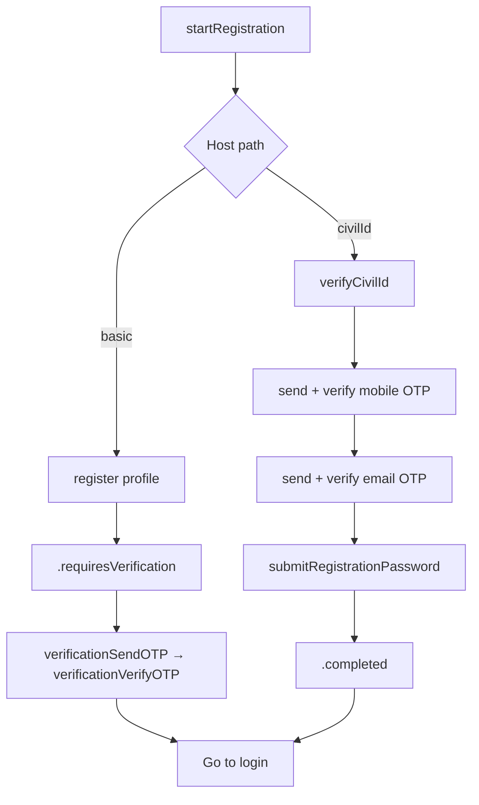

# Registration service

**AuthClient:** `AuthClient+Registration`  
**Domain:** `RegistrationFlowService` · **Requests:** `RegistrationRequest`  
**SSO refs:** [x-register-flow.md](../../../docs/sso-reference/x-register-flow.md), [x-register-flow-civilid.md](../../../docs/sso-reference/x-register-flow-civilid.md)

---

## 1. Purpose

Create a new account — either **basic** (profile + password → SSO verification flow) or **Civil ID wizard** (ID → mobile OTP → email OTP → password → login).

---

## 2. AuthClient APIs

| Method | Role |
|--------|------|
| `startRegistration()` | Create registration flow |
| `register(_:)` | Basic password registration |
| `verifyRegistrationCivilId(_:expiry:)` | Civil ID step |
| `sendRegistrationMobileOTP` / `resendRegistrationMobileOTP` | Mobile OTP |
| `verifyRegistrationMobileOTP` | Confirm mobile |
| `sendRegistrationEmailOTP` / `resendRegistrationEmailOTP` | Email OTP |
| `verifyRegistrationEmailOTP` | Confirm email |
| `submitRegistrationPassword` | Civil ID final password |

| Path | Typical `RegistrationStep` |
|------|----------------------------|
| **Basic** | `.requiresVerification` (SSO App Client always hands off to `/verification`) |
| **Civil ID** | `.completed` (identity / done — go to login; no verification handoff) |

---

## 3. Prerequisites

```swift
signupOptions: [.basic, .civilId]  // empty = signup disabled
```

`signupOptions` is independent of `loginOptions`. Missing method → client allow-list error before SSO.

---

## 4. Sequences

### Basic

| Step | API | HTTP |
|------|-----|------|
| 1 | `startRegistration()` | `GET {SSO_X}/registration/api` |
| 2 | `register(profile)` | `POST {SSO_X}/registration?flow=` |

### Civil ID

| Step | API | HTTP |
|------|-----|------|
| 1 | `startRegistration()` | `GET {SSO_X}/registration/api` |
| 2 | `verifyRegistrationCivilId` | `POST …/registration?flow=` |
| 3 | `sendRegistrationMobileOTP` | POST |
| 4 | `verifyRegistrationMobileOTP` | POST |
| 5 | `sendRegistrationEmailOTP` | POST |
| 6 | `verifyRegistrationEmailOTP` | POST |
| 7 | `submitRegistrationPassword` | POST |

---

## 5. Decision tree



Per SSO App Client docs: **basic** always jumps to the verification flow; **Civil ID** ends completed (`civilid_completed` / identity with verified contacts) — no `/verification` handoff.

---

## 6. Sample host Swift

```swift
// Basic → verification → login
try await auth.startRegistration()
let basicStep = try await auth.register(RegistrationProfile(
    email: email, mobile: mobile, username: name,
    password: pass, confirmPassword: pass
))
if case .requiresVerification = basicStep {
    try await auth.verificationSendOTP(channel: .email, identifier: email)
    try await auth.verificationVerifyOTP(code)
}
// navigate to login

// Civil ID → completed → login (no verification APIs)
try await auth.startRegistration()
try await auth.verifyRegistrationCivilId(civilId, expiry: "2026-01-01")
try await auth.sendRegistrationMobileOTP(mobile: mobile, username: name)
try await auth.verifyRegistrationMobileOTP(smsCode)
try await auth.sendRegistrationEmailOTP(email)
try await auth.verifyRegistrationEmailOTP(emailCode)
_ = try await auth.submitRegistrationPassword(password: pass, confirmPassword: pass)
// navigate to login — do not auto-exchange when session is nil
```

---

## 7. Request / response JSON

### 7.1 Start — `GET {SSO_X}/registration/api`

```json
{
  "id": "reg-flow-id",
  "type": "api",
  "ui": { "forms": [/* nodes */] },
  "expiresAt": "…",
  "issuedAt": "…"
}
```

### 7.2 Basic submit — `POST {SSO_X}/registration?flow=`

```json
{
  "email": "user@example.com",
  "mobile": "+9689xxxxxxx",
  "username": "display name",
  "firstname": "",
  "middlename": "",
  "lastname": "",
  "password": "••••••••",
  "confirmPassword": "••••••••",
  "resource": "{sso}{en}{…}",
  "method": "password"
}
```

**Success (App Client):** verification flow handoff (`action` → `/x/verification?flow=…`) → `.requiresVerification`. Errors in `ui` messages → `AuthError`.

### 7.3 Civil ID verify

```json
{
  "method": "civilid",
  "civilId": "12345678",
  "civilIdExpiry": "2026-01-01"
}
```

### 7.4 Send mobile OTP

```json
{
  "method": "civilid",
  "mobile": "+9689xxxxxxx",
  "username": "optional",
  "resource": "{sso}{en}{mobileOtpTmpl}",
  "useCivilIDMobile": true,
  "flowTokenId": "optional"
}
```

**Response includes** (in `ui` nodes):

```json
{
  "attributes": {
    "id": "flowTokenId",
    "name": "flowTokenId",
    "value": "n7q5bKAxZkJ754Ts2xLRae"
  }
}
```

### 7.5 Verify OTP (mobile or email)

```json
{
  "method": "civilid",
  "code": "123456",
  "flowTokenId": "n7q5bKAxZkJ754Ts2xLRae",
  "resource": "{sso}{en}{activeMobileTmpl}"
}
```

(Email verify uses `activeEmail` / `activeEmailTmpl`.)

### 7.6 Send email OTP

```json
{
  "method": "civilid",
  "email": "user@example.com",
  "resource": "{sso}{en}{emailOtpTmpl}",
  "flowTokenId": "…"
}
```

### 7.7 Civil ID password

```json
{
  "method": "civilid",
  "password": "••••••••",
  "confirmPassword": "••••••••"
}
```

---

## 8. Errors

| Situation | Handling |
|-----------|----------|
| Signup method not in `signupOptions` | Client allow-list `AuthError` |
| Validation / SSO reject | Flow `messages` → `AuthError` |
| Missing `flowTokenId` on verify | `invalidState` |

---

## 9. Notes

- Bodies match `RegistrationRequest` (not nested `traits.*`).
- **Basic:** `.requiresVerification` seeds `VerificationFlowService` — continue with [verification.md](./verification.md), then login.
- **Civil ID:** `.completed` → login only (OTPs already done on `/registration`; SSO does not hand off to `/verification`).
- Full Civil ID dumps: upstream `x-register-flow-civilid.md`.
