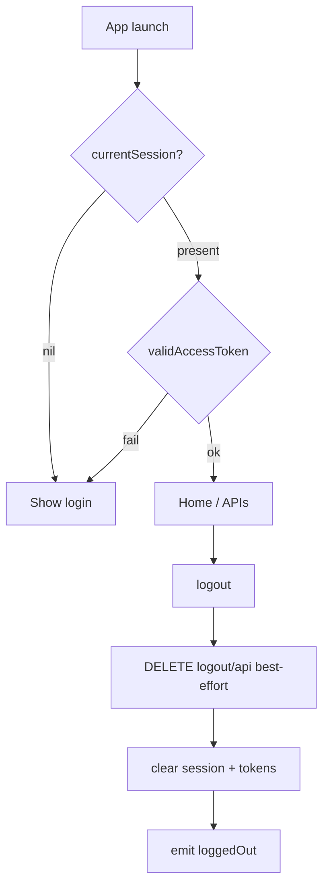

# Session & logout

**AuthClient:** `AuthClient+Session`, `AuthClient+Logout`  
**Storage:** `SessionStore`, `TokenStore` (Keychain by default)

---

## 1. Purpose

Read cold-start session/tokens, obtain a usable bearer, and sign out (remote best-effort + local clear).

---

## 2. AuthClient APIs

| Method | Role |
|--------|------|
| `currentSession()` | Load stored `Session` |
| `currentTokens()` | Load stored `TokenSet` |
| `accessToken()` | Raw access token (may be expired) |
| `validAccessToken(skew:)` | Refresh if needed → bearer |
| `refreshTokens()` | Force refresh — see [tokens.md](./tokens.md) |
| `logout()` | DELETE logout API + clear stores |

---

## 3. Prerequisites

Prior successful login / MFA / recovery + (usually) token exchange.

---

## 4. Sequence

| Step | API | HTTP |
|------|-----|------|
| Cold start | `currentSession` / `validAccessToken` | none / refresh as needed |
| Sign out | `logout()` | `DELETE {SSO}/logout/api` (Bearer) then clear local |

---

## 5. Decision tree



---

## 6. Sample host Swift

```swift
if let _ = try await auth.currentSession() {
    let bearer = try? await auth.validAccessToken()
    // route to home if bearer != nil
}

try await auth.logout()
```

---

## 7. JSON shapes

### Session (from login / MFA / recovery)

**MFA pending**

```json
{
  "id": "session-id",
  "active": true,
  "authenticatorAssuranceLevel": "aal1",
  "identity": null
}
```

**Complete**

```json
{
  "id": "session-id",
  "authenticatorAssuranceLevel": "aal2",
  "identity": {
    "userId": "…",
    "email": "…",
    "mobile": "…",
    "emailVerified": true,
    "mobileVerified": true
  }
}
```

MeeraAuth: `requiresMFA` ≡ `identity == null`.

### Logout

`DELETE {SSO}/logout/api` with Bearer access token when available. Response body is not required for host logic; local clear always runs.

---

## 8. Errors

`validAccessToken` / refresh failure → stores cleared + `.loggedOut`. Remote logout failure is ignored.

---

## 9. Notes

Events: `.sessionUpdated`, `.loggedIn`, `.tokensUpdated`, `.loggedOut` — see USAGE § Events.
