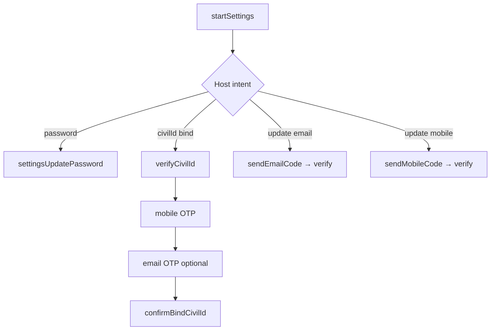

# Settings service

**AuthClient:** `AuthClient+Settings`  
**Domain:** `SettingsFlowService` · **Requests:** `SettingsRequest`  
**SSO ref:** [x-setting-flow-civilid.md](../../../docs/sso-reference/x-setting-flow-civilid.md)

---

## 1. Purpose

Authenticated settings: change password, bind Civil ID, update email/mobile with OTP. Requires an active session (`X-SESSION-ID`).

---

## 2. AuthClient APIs

| Method | Role |
|--------|------|
| `startSettings()` | Open settings flow |
| `settingsUpdatePassword` | Change password |
| `settingsVerifyCivilId` | Start Civil ID bind |
| `settingsSendMobileCode` / `settingsVerifyMobileCode` | Mobile OTP |
| `settingsSendEmailCode` / `settingsVerifyEmailCode` | Email OTP |
| `settingsConfirmBindCivilId` | Finish Civil ID bind |

---

## 3. Prerequisites

- Session from login / MFA / recovery  
- Optional bearer on start (`accessToken` from token store)  

---

## 4. Sequences

### Password (e.g. after recovery)

| Step | API | HTTP |
|------|-----|------|
| 1 | `startSettings()` | `GET {SSO_X}/settings/api` |
| 2 | `settingsUpdatePassword` | `POST {SSO_X}/settings?flow=` |

### Civil ID bind

```text
startSettings
→ settingsVerifyCivilId
→ settingsSendMobileCode → settingsVerifyMobileCode
→ settingsSendEmailCode → settingsVerifyEmailCode   // if required
→ settingsConfirmBindCivilId
```

---

## 5. Decision tree



---

## 6. Sample host Swift

```swift
try await auth.startSettings()
try await auth.settingsUpdatePassword(password: newPass, confirmPassword: newPass)

// Civil ID bind (abbreviated)
try await auth.startSettings()
try await auth.settingsVerifyCivilId(civilId, expiry: expiry)
try await auth.settingsSendMobileCode(mobile: mobile)
try await auth.settingsVerifyMobileCode(code)
try await auth.settingsConfirmBindCivilId()
```

---

## 7. Request / response JSON

### 7.1 Start — `GET {SSO_X}/settings/api`

**Headers:** `X-SESSION-ID`, optional `Authorization: Bearer`

```json
{
  "id": "settings-flow-id",
  "type": "api",
  "ui": { "forms": [/* password, civilid, … */] }
}
```

### 7.2 Update password

```json
{
  "method": "password",
  "password": "••••••••",
  "confirmPassword": "••••••••"
}
```

### 7.3 Verify Civil ID

```json
{
  "method": "civilid",
  "civilId": "12345678",
  "civilIdExpiry": "2026-01-01"
}
```

### 7.4 Send mobile code

```json
{
  "method": "civilid",
  "mobile": "+9689xxxxxxx",
  "resource": "{sso}{en}{mobileOtpTmpl}",
  "civilIdUpdate": true,
  "useCivilIDMobile": true,
  "username": "optional"
}
```

### 7.5 Verify mobile / email code

```json
{
  "method": "civilid",
  "code": "123456",
  "flowTokenId": "…"
}
```

### 7.6 Send email code

```json
{
  "method": "civilid",
  "email": "user@example.com",
  "resource": "{sso}{en}{emailOtpTmpl}"
}
```

### 7.7 Confirm bind

```json
{
  "method": "civilid"
}
```

---

## 8. Errors

No session → `noActiveSession`. SSO validation → flow `messages` → `AuthError`.

---

## 9. Notes

Bodies match `SettingsRequest`. Full UI dumps: upstream settings doc.
