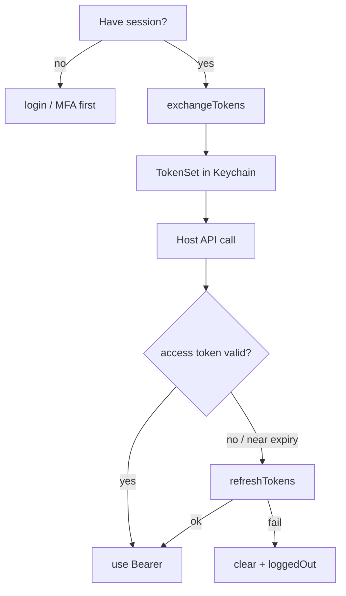

# Token service

**AuthClient:** `exchangeTokens()`, `refreshTokens()`, `validAccessToken(skew:)`, `currentTokens()`, `accessToken()`  
**Domain:** `TokenService` · **Requests:** `TokenRequest`  
**SSO ref:** Exchange section in [x-login-flow.md](../../../docs/sso-reference/x-login-flow.md)

---

## 1. Purpose

Turn a completed SSO **session** into OAuth tokens; later refresh the access token without re-login.

---

## 2. AuthClient APIs

| Method | Role |
|--------|------|
| `exchangeTokens()` | Session → `TokenSet` (Keychain) |
| `refreshTokens()` | Force refresh; failure clears session + `.loggedOut` |
| `validAccessToken(skew:)` | Return usable bearer (refresh if near expiry) |
| `currentTokens()` / `accessToken()` | Read store (may be expired) |

---

## 3. Prerequisites

- Active session after login / MFA / recovery (as applicable)  
- Include `.offlineAccess` in scopes for `refresh_token`  

---

## 4. Sequence

| Step | API | HTTP |
|------|-----|------|
| 1 | `exchangeTokens()` | `POST {SSO_X}/token/exchange` + `X-SESSION-ID` |
| 2 | later `validAccessToken` / `refreshTokens` | `POST {SSO}/token` |

Note: refresh uses **`ssoEndpoint`**, not `ssoXEndpoint`.

---

## 5. Decision tree



---

## 6. Sample host Swift

```swift
let tokens = try await auth.exchangeTokens()

// Prefer for host networking:
let bearer = try await auth.validAccessToken(skew: 60)
// Authorization: Bearer \(bearer)
```

---

## 7. Request / response JSON

### 7.1 Exchange — `POST {SSO_X}/token/exchange`

**Encoding:** `application/x-www-form-urlencoded`  
**Headers:** `X-SESSION-ID: {sessionId}`

```
client_id=mobile-app
scope=openid email mobile groups profile offline_access
```

**Response**

```json
{
  "access_token": "eyJhbGciOiJSUzI1NiIs…",
  "id_token": "eyJhbGciOiJSUzI1NiIs…",
  "refresh_token": "ChZKaFlKaDY2dllQ…",
  "token_type": "bearer",
  "expires_in": 86400
}
```

Decoded as `TokenSet` via `JSONDecoder` (Codable). Emits `.tokensUpdated`.

### 7.2 Refresh — `POST {SSO}/token`

```
grant_type=refresh_token
refresh_token=…
client_id=mobile-app
scope=openid email mobile groups profile offline_access
```

**Response:** same token object shape. MeeraAuth merges into stored `TokenSet` (keeps refresh token if omitted).

---

## 8. Errors

| Situation | Handling |
|-----------|----------|
| No session | `noActiveSession` |
| No refresh token | Message to include `.offlineAccess` and re-auth |
| Refresh 401/403 | Clears stores, emits `.loggedOut` |

---

## 9. Notes

Concurrent `refresh()` callers share one in-flight request inside `TokenService`.
