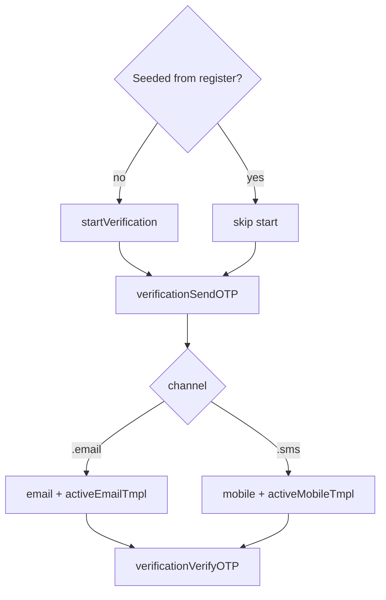

# Verification service

**AuthClient:** `AuthClient+Verification`  
**Domain:** `VerificationFlowService` · **Requests:** `VerificationRequest`  
**SSO ref:** [x-verification-flow.md](../../../docs/sso-reference/x-verification-flow.md)

---

## 1. Purpose

Activate email or mobile (post-registration, or when SSO hands off a verification flow).

Unlike **login MFA**, the **host chooses** the channel.

---

## 2. AuthClient APIs

| Method | Role |
|--------|------|
| `startVerification()` | New verification flow (skip if seeded from register) |
| `verificationSendOTP(channel:identifier:)` | Send OTP |
| `verificationResendOTP()` | Resend |
| `verificationVerifyOTP(_:)` | Confirm code |

---

## 3. Prerequisites

- Fresh: call `startVerification()` first  
- After register `.requiresVerification`: flow already seeded — go straight to send OTP  

---

## 4. Sequence

| Step | API | HTTP |
|------|-----|------|
| 1 | `startVerification()` | `GET {SSO_X}/verification/api` |
| 2 | `verificationSendOTP` | `POST {SSO_X}/verification?flow=` |
| 3 | `verificationVerifyOTP` | `POST {SSO_X}/verification?flow=` |

---

## 5. Decision tree



---

## 6. Sample host Swift

```swift
try await auth.startVerification() // omit if seeded
try await auth.verificationSendOTP(channel: .email, identifier: email)
try await auth.verificationVerifyOTP(code)
```

---

## 7. Request / response JSON

### 7.1 Start — `GET {SSO_X}/verification/api`

```json
{
  "id": "verify-flow-id",
  "type": "api",
  "state": "choose_method",
  "ui": {
    "forms": [
      {
        "nodes": [
          {
            "attributes": {
              "id": "method",
              "name": "method",
              "value": "captcha"
            }
          }
        ]
      }
    ]
  }
}
```

SSO uses `"method": "captcha"` in App Client payloads (not an image-captcha UI in MeeraAuth).

### 7.2 Send OTP

**Email**

```json
{
  "method": "captcha",
  "email": "user@example.com",
  "resource": "{sso}{en}{activeEmailTmpl}"
}
```

**SMS**

```json
{
  "method": "captcha",
  "mobile": "+9689xxxxxxx",
  "resource": "{sso}{en}{activeMobileTmpl}"
}
```

**Response:** flow with `flowTokenId` in `ui` nodes.

### 7.3 Verify OTP

```json
{
  "method": "captcha",
  "code": "123456",
  "flowTokenId": "…"
}
```

Do not send email/mobile on verify.

---

## 8. Errors

Flow `messages` → `AuthError`. Missing flow / token → `invalidState`.

---

## 9. Notes — channel ownership

| Flow | Who picks email vs SMS |
|------|-------------------------|
| Login MFA | **Server** `active` |
| Verification | **Host** `MFAChannel` |
| Recovery | **Host** `LoginOption` |
